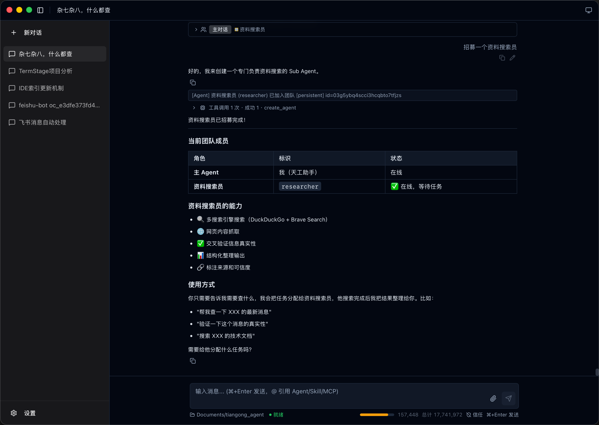

# Silent-Tiangong（天工）

[](LICENSE)
[](https://github.com/silent-rs/silent-Tiangong/releases)
[](https://github.com/silent-rs/silent-Tiangong/actions/workflows/ci.yml)

> 面向个人工作流的桌面级 AI 自动化中枢：对话、规划、执行、记忆、工具调用、嵌入式浏览器、多智能体协作、移动端控制和定时任务。

天工是一个基于 Rust、Tauri 和 silent 构建的个人智能终端，以桌面应用为核心形态，同时提供无界面运行方式接入脚本、服务或外部消息通道。核心目标不是只回答问题，而是让 Agent 能围绕真实工作区读取资料、拆解任务、调用工具、执行命令、保存长期记忆，并在你主动要求分工时招募 Sub Agent 协作。

天工内置嵌入式浏览器，Agent 可自主打开网页、读取页面内容、点击元素和填写表单，同时感知用户在浏览器中的操作行为，实现人机协同浏览；通过飞书、微信、QQ 等 IM 平台接入移动端控制，可随时随地远程驱动 Agent，配合定时任务和 Webhook 实现按计划或按事件自动执行。

模型方面，天工完全适配 DeepSeek 的上下文缓存机制，多轮对话中历史消息可被高效命中缓存，显著降低重复传输成本并提升响应速度；DeepSeek 适配已跟进 V4 新版接口（`deepseek-v4-pro` / `deepseek-v4-flash`），支持思考模式（`reasoning_effort` 分档控制）、结构化与文本协议双通道工具调用解析，以及流式 KV cache 命中率统计。模型推荐使用 [DeepSeek](https://www.deepseek.com/)、[Kimi](https://kimi.com/) 的 kimi-k3 和 [智谱](https://www.bigmodel.cn/) 的 GLM5.2，其他模型可以通过自定义供应商接入。

> 安全提示：天工当前未使用沙箱技术隔离工具执行环境。如果你对本地文件访问、命令执行或自动化操作的隔离要求较高，建议暂时考虑其他软件。



## 项目起源

天工的出发点很简单：让 AI 不只是聊天，而是能真正帮你干活。遇到需要读文件、跑命令、查资料、操作网页这类实际工作，当前体验最好的是 Claude、Codex、OpenCode 这类 CLI 终端工具，但它们受限于终端环境，无法提供可视化的操作界面和交互反馈。

主流大厂的产品则集中在两个方向：Claude 桌面端资源消耗巨大，ChatGPT 桌面端只有搜索能力，而且它们的核心场景都是 coding。对于普通用户来说，这些产品对接其他平台模型也不够直观，需要一定的折腾能力。更重要的是，现有工具在浏览网页等交互式场景中人的参与度过低——提交任务后只能等待结果，或者直接打断再继续和 Agent 沟通，缺乏实时协同的能力。

天工的答案是内置嵌入式浏览器：用户和 Agent 可以同时操作同一个页面，Agent 自主完成任务的同时能感知用户的操作行为，实现真正的人机协同。再加上多智能体协作、长期记忆、多媒体生成等能力，不限于写代码，而是覆盖日常工作全场景的个人智能终端。

整个项目用 Rust 构建，单机运行，数据本地存储，不依赖云服务。

## 核心能力

| 能力         | 说明                                                                                         |
| ------------ | -------------------------------------------------------------------------------------------- |
| 桌面 Agent    | Tauri + React + shadcn/ui 桌面界面，支持会话、工作区、工具过程、模型配置和运行状态展示       |
| 嵌入式浏览器  | 内置多标签浏览器，Agent 可自主浏览网页、读取页面内容、点击元素、填写表单，用户也可手动操作   |
| 多智能体协作  | 主 Agent 可按任务创建 PM、Developer、Tester、Researcher 等 Sub Agent，并通过消息和文件锁协作 |
| 插件生态      | 能力以插件形式提供，支持 WASM 逻辑插件、TypeScript 工具插件、纯 UI 插件等多种形态，内置插件支持默认推荐、安装进度与按需启停，并提供脚手架与模板自建插件 |
| 移动端控制    | 通过独立 Bot 制品接入飞书、微信、QQ，支持扫码配置、运行托管、日志查看和图片/文件收发         |
| DeepSeek V4   | 适配 V4 新版接口，支持思考模式分档、结构化与文本协议双通道工具调用解析、流式 KV cache 统计   |
| 权限治理      | 桌面会话可在监督模式和信任模式之间切换，无界面运行时使用受控的远程角色边界                    |
| 发布更新      | GitHub Release 分发安装包，桌面设置页和 `tiangong update` 共用在线更新链路                   |

## 插件系统

天工的能力以插件形式提供并独立演进，插件通过清单声明入口、权限与能力，运行在受控运行时中与主程序解耦。支持多种插件形态，覆盖从纯界面到带原生 sidecar 的完整场景：

| 形态                 | 适用                                                         |
| -------------------- | ------------------------------------------------------------ |
| 纯 UI 插件           | 面板、工具页、输入区动作，标准前端工程（推荐 Vue 3 + Vite）  |
| TypeScript 工具插件  | 带 UI 的工具提供器、审批与用户征询                           |
| WASM 逻辑层插件      | 工具、提示词、生命周期与原生 sidecar                         |
| 混合插件             | UI 挂载 + WASM/sidecar 能力组合                              |

- **权限与能力声明**：插件在清单中声明 `entrypoints`、`permissions` 与 `capabilities`，主程序按声明路由请求。
- **独立签名发布**：每个插件单独构建、签名和发布，CI 校验签名清单与目录结构，支持默认插件推荐、安装进度展示、按需启停与更新，失败不影响主进程稳定性。
- **自建插件**：提供脚手架与工程模板（ui-app / ts-tool / ts-npx / node-sidecar），可通过 `cargo run -p xtask -- new-plugin <id>` 或 [`@silent-ai/plugin-creator`](plugins/devkit) 初始化；构建产物经「设置 → 插件管理 → 导入本地插件」走正式安装链路（清单校验 → 事务安装 → 注册表加载），官方 Creator 插件还支持在天工内直接创建、签名并安装插件。

插件源码位于根目录 [`plugins/`](plugins/)，编写自己的插件请参考 [插件开发指南](docs/plugin-development.md)。

## 多智能体协作

多智能体协作适合资料搜集、代码实现、测试验证、方案评审等需要分工的任务。Sub Agent 由用户主动招募——当你明确要求并行处理、分工协作、组建团队，或用 `@角色` 提及一个尚未创建的成员时，主 Agent 才会创建对应的 Sub Agent；单轮可完成的任务则直接由主 Agent 处理，不会主动拆分团队。每个 Sub Agent 拥有独立的角色、状态和上下文。

```text
用户提出复杂任务并要求分工 / 并行 / @角色
    ↓
主 Agent 按需求招募对应角色的 Sub Agent
    ↓
Sub Agent 独立执行、互相发消息、必要时获取文件锁
    ↓
主 Agent 汇总结果并回复用户
```

已支持的协作方式：

- 按需招募和解散 Sub Agent，默认不主动创建。
- `send_message` / `broadcast_message` 进行 Agent 间通讯。
- `@dev`、`@test`、`@all` 等语法直接向指定 Agent 发送消息。
- Sub Agent 可直接向前端推送进度、阻塞和问题。
- 文件编辑前获取锁，避免多个 Agent 同时修改同一文件。
- 前端按 Agent 分 Tab 展示执行细节、状态和通知。

详细设计见 [RFC 0011：多智能体协作系统](docs/rfc/0011-multi-agent-collaboration.md)。

## 嵌入式浏览器

天工内置基于 WKWebView 的多标签浏览器，支持 Agent 自主浏览和用户手动操作两种模式协同工作：

- **Agent 自主浏览**：Agent 可通过 `web_fetch` 工具打开网页、读取页面内容、提取表单、点击元素和填写字段，操作结果自动注入回对话上下文。
- **用户手动操作**：用户在浏览器中浏览、点击、输入时，Agent 通过页面快照和网络事件感知用户行为，结合对话内容给出上下文相关的建议。
- **浏览历史**：支持全局浏览历史和标签页内前进/后退导航，历史记录持久化存储。
- **智能感知**：Agent 在执行过程中自动检测页面变化（URL 切换、内容更新、网络请求），仅在变化时注入数据，避免重复干扰。

## 移动端控制

天工通过独立 Bot 制品接入第三方 IM 平台，实现移动端远程控制：天工负责下载、配置、启动、监控和升级 Bot，Bot 通过 Server API 与天工通信。平台专属的扫码授权和凭证存储完全由对应 Bot 制品负责，天工只接收运行状态。

- **已支持平台**：飞书、微信、QQ，并支持本地自有 Bot 接入与第三方 Bot 目录贡献。
- **扫码配置**：桌面端调用 Bot 制品发起扫码，展示授权二维码与状态；扫码所得凭证由 Bot 自行保存，天工不接触明文。
- **运行托管**：Bot 随天工自动运行或手动启停，支持日志查看、配置删除、自动注入天工服务地址和 Token，Windows 停止时抑制终端窗口闪现。
- **MCP 主动推送**：Bot 自动维护已授权主动发过消息的多目标清单，具备文本、图片和文件推送能力，MCP 注册和注销绑定到 Bot 启停流程。
- **远程管理**：通过 `tiangong bot` 子命令可在无图形界面环境下完成 Bot 的全生命周期管理。

## 定时与触发

调度与触发能力通过 `scheduler` 插件提供（底层基于 `tiangong-scheduler` crate），用于按计划或外部事件驱动 Agent 执行：

- **定时任务**：JSON 文件存储（`~/.tiangong/scheduler/`），复用 silent 框架内置 Scheduler，Server 启动时自动恢复已启用的 Cron Job。
- **双模式编辑**：桌面端提供简单模式和 Cron 模式两种编辑器，内置校验和下次触发预览，可关联已有会话复用上下文或自动创建新会话。
- **Webhook 触发**：Server 内置独立于定时任务的 HTTP 触发能力（`~/.tiangong/webhooks/`），提供无需认证的外部触发端点和需认证的管理端点，支持可选签名验证。
- **结果推送**：定时任务和 Webhook 触发的结果可推送到指定 Bot 通道，与移动端控制联动。

## 架构

天工采用 Cargo workspace 多 crate 结构，核心引擎和各入口解耦：

```text
crates/
  tiangong-types/       公共类型、消息、会话、任务状态和流事件
  tiangong-config/      配置加载、持久化和日志初始化
  tiangong-llm/         LLM 协议抽象和 Provider 封装
  tiangong-anthropic/   Anthropic Messages API 与 SSE 适配
  tiangong-core/        Agent 循环、工具调用、MCP、Skill、多 Agent 团队
  tiangong-memory/      长期记忆、检索、反刍和工作区隔离
  tiangong-bots/        移动端控制：Bot 制品下载、配置、启停和监控
  tiangong-scheduler/   定时任务（Cron）与 Webhook 触发
  tiangong-cli/         CLI / TUI 前端
  tiangong-entry/       统一命令入口
  tiangong-server/      HTTP REST + WebSocket Server
  tiangong-media/       图片、视频、语音等多媒体能力
  plugins/              可插拔能力（fs/command/fetch/mcp/skill/memory/
                        scheduler/index/media/prompt/coding/computer-use/
                        browser/terminal/interaction 等，含 WASM 与
                        TypeScript/纯 UI 多种形态）
  crates/plugins/       内置插件（agent-team）
frontend/               桌面前端
src-tauri/              Tauri 桌面壳
```

核心执行流程：

```text
用户输入
  ↓
会话与工作区上下文装配
  ↓
ReAct 循环：推理、工具调用、观察、继续执行
  ↓
默认由主 Agent 直接完成；用户要求分工时招募 Sub Agent 协作
  ↓
结构化事件实时推送到桌面界面与无界面入口
```

## 安装

### 从发布包安装

在 [GitHub Releases](https://github.com/silent-rs/silent-Tiangong/releases) 下载当前系统对应的安装包：

- macOS：下载 `.dmg`，打开后将「天工」拖入「应用程序」目录。
- Windows：下载 `.msi` 或 `.exe`，按安装向导完成安装。
- Linux：下载 `.AppImage`、`.deb` 或 `.rpm`，按发行版习惯安装或直接运行。

macOS 当前构建暂未接入 Apple 签名和公证，首次打开如提示应用已损坏，可执行：

```bash
xattr -cr /Applications/天工.app
```

### Linux 服务器安装

在无桌面环境的服务器上（VPS、云主机、Docker 容器），推荐通过源码编译获得纯 CLI/Server 二进制（不依赖 WebKit/GTK 等桌面运行时）：

```bash
# 安装编译依赖（Debian/Ubuntu）
sudo apt-get install -y build-essential pkg-config protobuf-compiler libssl-dev ca-certificates curl

# 安装 Rust
curl --proto '=https' --tlsv1.2 -sSf https://sh.rustup.rs | sh && source "$HOME/.cargo/env"

# 编译
git clone https://github.com/silent-rs/silent-Tiangong.git && cd silent-Tiangong
cargo build --release
sudo install -m 0755 target/release/tiangong /usr/local/bin/tiangong
```

服务端通过模块化 CLI 完成无界面配置（详见 [`docs/linux-server-deployment.md`](docs/linux-server-deployment.md)）：

```bash
tiangong model add-provider deepseek --protocol deepseek --base-url https://api.deepseek.com --api-key-env DEEPSEEK_API_KEY
tiangong model add-model deepseek-v4-pro --provider deepseek --model-id deepseek-v4-pro --capability chat
tiangong model route set chat deepseek-v4-pro
tiangong server config set --host 127.0.0.1 --port 8080
tiangong server token generate
tiangong doctor
tiangong server -d
```

### 命令行入口

桌面安装包内包含同一个 `tiangong` 入口，可用于更新、诊断和后台服务。macOS 可创建软链接：

```bash
ln -s /Applications/天工.app/Contents/MacOS/天工 /usr/local/bin/tiangong
```

Windows 可将安装目录加入 `PATH`。Linux 安装包通常会直接提供可执行入口。

## 使用

天工以桌面应用为主要使用方式，模型配置、插件安装与会话管理均可在设置页完成。源码运行时默认启动桌面应用：

```bash
cargo run --release
```

需要接入外部系统或在无桌面环境运行时，同一入口也提供无界面运行方式（详见 [Linux 服务器部署指南](docs/linux-server-deployment.md)）：

```bash
tiangong server -d        # 后台启动 Server
tiangong server stop      # 停止后台 Server
tiangong update --check   # 检查更新
```

**更新机制**：桌面应用通过设置页或 `tiangong update` 自动下载安装更新；无界面二进制（Linux 服务器）当前需重新编译或下载新版本二进制替换（`tiangong update --check` 仅检查版本不自动安装）。配置独立存储在 `~/.tiangong/`，更新二进制不丢失配置。

### 模块化配置（0.12.0+）

无桌面环境可通过 CLI 完成与桌面设置页等价的分模块配置（设计详见 [RFC 0015](docs/rfc/0015-cli-modular-config.md)）：

```bash
tiangong model list                      # 查看模型配置
tiangong model route set chat deepseek-v4-pro  # 切换 chat 模型
tiangong server token show               # 查看 Server Token
tiangong memory enable                   # 启用 Memory
tiangong prompt edit                     # 编辑自定义 Prompt
tiangong bot list                        # 查看已配置 Bot
tiangong bot start feishu                # 启动指定 Bot
tiangong config show                     # 配置概览
tiangong doctor                          # 环境诊断
```

## 配置

默认数据目录：

```text
~/.tiangong/
  models.json           模型配置：Provider + Model + Routing
  server.json           Server 监听配置（host/port/auth_token）
  custom-prompt.md      自定义 Prompt（独立文件，CLI 可直接编辑）
  skills.json           Skill 配置
  mcp.json              MCP 配置
  sessions/             会话持久化
  logs/                 运行日志
  media/                生成或归档的媒体文件
  memory/               长期记忆数据（含独立 config.json）
```

模型配置采用 Provider、Model、Routing 三层结构。`api_key` 支持 `${ENV_VAR}` 环境变量引用，便于避免明文保存密钥。自定义 Prompt 独立存储为 `custom-prompt.md`，可通过 `tiangong prompt` 命令管理。

详细的 Linux 服务器部署、systemd 托管、反向代理与更新策略见 [部署指南](docs/linux-server-deployment.md)。

## 开发

开发或本地调试插件前，请先阅读 [插件开发指南](docs/plugin-development.md)，了解插件形态、清单、构建、sidecar 接入和本地导入流程。

```bash
# Rust 检查
cargo check --workspace

# Rust lint
cargo clippy --workspace --all-targets --tests --benches -- -D warnings

# 格式化
cargo fmt

# 前端构建
yarn --cwd frontend build

# 完整检查链
cargo fmt -- --check && cargo check --workspace && cargo clippy --workspace --all-targets --tests --benches -- -D warnings && cargo nextest run --workspace --no-tests pass
```

前端开发使用 yarn：

```bash
yarn --cwd frontend install
yarn --cwd frontend dev
```

## 文档

- [插件开发指南](docs/plugin-development.md)
- [CLI 配置指南](docs/cli-configuration-guide.md)
- [Server API](docs/server-api.md)
- [Linux 服务器部署指南](docs/linux-server-deployment.md)
- [Bot MCP 主动推送设计](docs/bot-mcp-proactive-push-design.md)
- [RFC 0011：多智能体协作系统](docs/rfc/0011-multi-agent-collaboration.md)
- [RFC 0015：CLI 模块化配置](docs/rfc/0015-cli-modular-config.md)

## 许可证

[Apache License 2.0](LICENSE)
