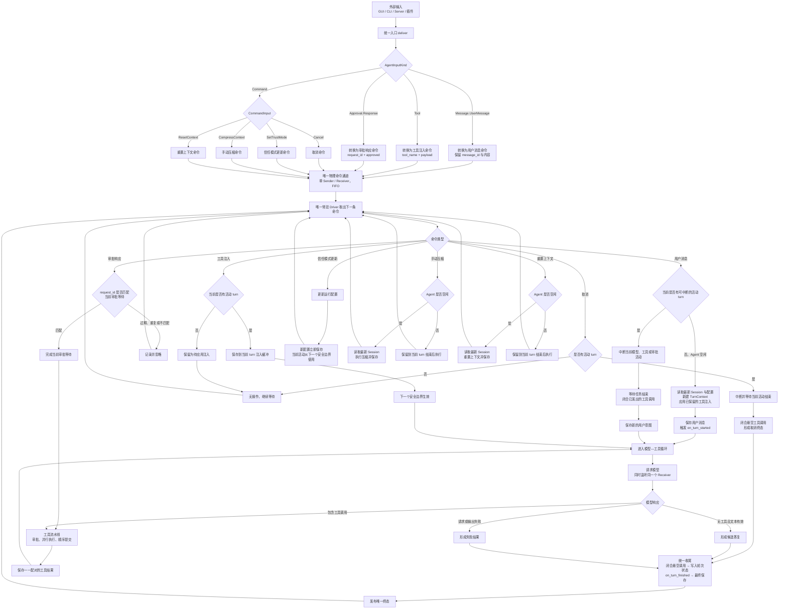

# Agent 执行核心重构 — 统一通道设计

> 2026-08-16 定稿：本文档取代此前的 `requirements.md`、`design.md`、`progress.md` 与 `tasks/`（2026-08-14 版，已失效并删除）。
> 旧方案中的 `next_turn` FIFO、单槽、终态封口（Sealing/Committing）、唤醒锁存等机制已在评审讨论中废除；本文档记录当前定稿的主流程、决策理由与待细化项。

## 1. 总体形态

一句话概括：**一个通道、一个 Driver、一个循环。**

## 2. 已定稿决策

### 2.1 统一投递入口

所有外部输入（GUI / CLI / Server、插件反馈）只经 `deliver` 一个入口进入，不存在第二条写入路径。投递方不做任何状态判断。

### 2.2 唯一物理命令通道

- 每个 Agent 只有一个物理命令通道；用户消息、取消、审批响应、工具注入、插件反馈和运行配置更新都发送到同一个 Sender/Receiver；
- 禁止增加“快速通道 + 普通通道”、旁路取消通道或按命令类型拆分接收端；`deliver` 成功只表示命令已进入这个唯一通道；
- 通道按接收顺序保存命令。没有单槽、没有 Busy 拒绝，也不维护独立的未来任务队列；通道中的短暂积压仅表示尚未被 Driver 消费的信令；
- Driver 空闲时直接阻塞等待该 Receiver，因此单槽（`pending_input`）与唤醒锁存（`Notify` / `try_park`）机制全部删除。

### 2.3 单通道内的处理优先级

单通道只保证接收顺序，不在投递层重排命令。所谓“优先级”是 Driver 取出命令后的处理策略，不是第二条通道：

| 处理级别 | 命令 | 语义 |
| --- | --- | --- |
| 中断类 | 用户消息、取消 | Driver 一旦从单通道取到，立即中断当前模型请求、工具批次或审批等待；完成协议收敛后处理该命令 |
| 当前活动完成类 | 与当前 `request_id` 匹配的审批响应 | 立即交给正在等待的审批活动，使该活动可以正常结束；它不是延迟到 step 边界的普通注入 |
| 边界类 | 工具注入、插件反馈、运行配置更新等 | 不主动中断当前活动，在当前活动自然结束或下一个安全边界生效 |

具体规则：

1. 所有命令先按单通道 FIFO 顺序被 Driver 接收，不允许后到的取消或用户消息越过已经接收但尚未分类的命令；
2. Driver 可以把已接收命令暂存到内部待处理集合，但必须保留每条命令的接收序号；同一处理级别严格按序处理；
3. 中断类命令只中断 Loop 当前直接拥有的活动，不能跳过协议闭合、任务 `abort` 后的 join 收敛或必要持久化；
4. 与当前审批请求匹配的响应用于完成审批等待；过期、不匹配或重复的审批响应记录后忽略，不得影响后续 turn；
5. 边界类命令不得因连续中断类命令永久丢失；当前活动收敛后必须按接收顺序处理已暂存的边界命令；
6. “到达即处理”统一解释为：命令被 Driver 从唯一 Receiver 取到后立即执行对应策略，而不是绕过 FIFO 或建立旁路通道。

### 2.4 消息语义按状态统一

- 消息进入唯一物理命令通道，调用方无需声明 followup/steer 语义；
- Driver 取出用户消息时：没有活动 turn 则开启新 turn，存在可中断的活动 turn 则作为引导修正当前意图；
- 连发多条消息仍按通道接收顺序逐条处理，不允许后到消息越过先到消息。

### 2.5 新消息 = 新 turn = 新建 TurnContext

- 空闲期新消息由 Driver 取出后开新 turn，从最新磁盘 Session 与最新配置新建 TurnContext；
- 禁止为未来 turn 提前构造 Session/TurnContext 快照（保留 ALR-204 原则）。

### 2.6 唯一 Driver 常驻

- 同一 Agent 至多一个 Driver，常驻消费唯一 Receiver；
- 空闲时阻塞在该 Receiver 上等待，有命令自然唤醒，不存在额外的唤醒锁存；
- 模型请求、工具执行和审批等待均由同一 Driver 通过 `select!` 同时监听这个 Receiver，不得为不同阶段复制命令接收器；
- turn 结束后继续消费同一 Receiver；下一条用户消息按当时状态开启新 turn，其他命令按各自边界语义处理。

### 2.7 无封口

终态封口（Sealing/Committing 状态机、用户消息与取消的特殊放行、封口排空与撤销提交）整体删除。它防的竞态已被通道与 Driver 主循环兜底：

| 提交窗口内到达 | 去向 | 结果 |
| --- | --- | --- |
| 用户消息 | 留在通道，turn 结束后 Driver 立即取走 | 开启新 turn，不丢 |
| 取消 | turn 马上自然结束 | 取消一个已完成的事，无操作 |
| 工具注入 | 留在通道 | 下个 turn 开始时领取，符合 inject 语义 |

错过提交窗口的唯一后果是"该消息变成新任务而非当前任务的修正"，语义更干净，不存在"候选到底算不算已提交"的模糊性。

### 2.8 收尾协议闭合

turn 无论以何种方式结束（完成、取消、失败），收尾阶段统一执行：

1. **闭合悬空工具调用**：为会话中没有配对结果的 tool_call 补失败结果，保证 Provider 历史 `Assistant(tool_call) → Tool(result)` 配对，否则下一轮请求会被 Provider 拒绝；
2. 本轮存在被中断的工具调用时，即使模型答复本身成功也降级为失败，不许带着未兑现的动作宣称成功；
3. 写入轮次状态、触发收尾钩子、最终保存、发布唯一终态。

### 2.9 范围排除

上下文压缩与清理（手动压缩、重置上下文、请求前压缩）已基本定型，不属于本重构讨论范围。

## 3. 方案演进记录

| 阶段 | 消息机制 | 问题 |
| --- | --- | --- |
| 设计初版 | `next_turn` FIFO 排队归 core | 排队是产品策略，core 不该替产品决定 |
| 第一轮收敛（2026-08-15） | 单槽 + Busy，排队归 app 层 | 仍有单槽占用竞态、双路径判定（有活动轮走注入 / 无活动轮占槽）、唤醒锁存机制 |
| 当前定稿（2026-08-16） | 统一命令通道，消息即信令 | — |

封口的演变：诞生于旧架构（临时队列 + 每消息后台任务交接，错过提交窗口的消息要靠补偿任务接手）；在统一通道下消息永不丢、Driver 永远取下一条，撤销提交重执行不再有不可替代的价值，整体删除。

## 4. 保留的既有原则

以下原则未被推翻，继续有效：

1. Session 是唯一真源；新 turn 启动时读取最新数据；
2. Agent 对外只有 `Idle | Running`；
3. 一个逻辑 turn 只触发一次 `on_turn_started`、一次 `on_turn_finished` 和一个最终终态；
4. 关闭时不静默丢弃已确认消息；
5. 审批属于工具流水线，请求重试与错误恢复属于模型请求策略；
6. 工具使用由模型自主决策，不叠加义务门控防护层；
7. Loop 主干只做"请求模型 → 执行工具 → 再请求模型"；模型无工具响应只是候选答复。
8. 桌面端只在 Agent 当前活动与待处理用户输入都结束后向界面发布可切换为 `Idle` 的 `Done`；连续消息之间的中间 `Done` 仅用于后端完成本轮收尾，不向界面发布，避免状态闪烁。

## 5. 待细化清单

1. **引导生效细节**：中断模型请求后，未完成协议如何闭合、新意图如何保存、重新请求的顺序；
2. **工具执行流水线**：审批、并行上限、结果顺序提交、协议闭合；
3. **取消与关闭**：用户取消的收敛路径、Core 关闭时未处理消息的去向；
4. **失败路径**：最终保存失败降级、TurnContext 构建失败、关闭排空落盘失败。
