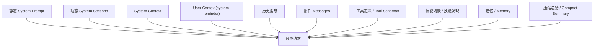
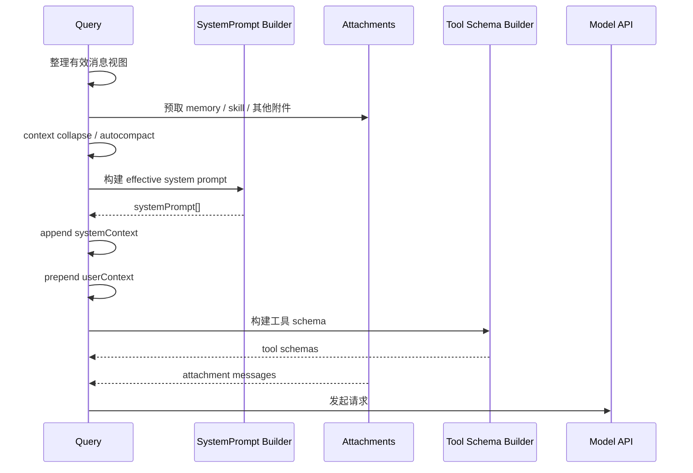

# Prompt 组织方法分析

## 1. 文档目标

本文档整理该项目中 prompt 的组织方式，重点回答以下问题：

- prompt 被拆成了哪些层
- 这些层如何组合成一次实际请求
- 为什么项目要这样组织 prompt
- 这种组织方式解决了哪些工程问题

本文档关注的是“prompt 作为运行时结构”的设计，而不只是某一段 system prompt 文案。

## 2. 总体结论

这个项目的 prompt 组织方法不是“写一大段 system prompt 然后每轮追加消息”，而是一个多层装配系统。

其核心特征有五个：

- `system prompt` 被拆成静态块和动态块，而不是单字符串
- `system context` 和 `user context` 分开注入，分别承担不同职责
- 工具、技能、记忆、附件并不都常驻，而是按需进入当前轮上下文
- prompt 组织高度受缓存稳定性约束，很多实现是为了减少 cache miss
- 长对话下不是简单截断，而是通过 `collapse / compact / attachment` 维持可继续工作的 prompt 视图

一句话概括：它把 prompt 视为“可编排的上下文结构”，不是“固定模板 + 聊天历史”。

## 3. Prompt 总体结构

一次完整请求中，模型看到的内容大致可以抽象为：

需要注意两点：

1. `system prompt` 和 `messages` 是两条不同通道
2. 很多“看起来像 prompt 的内容”，实际上是 attachment message，而不是 system prompt 本体

这意味着项目并不追求把所有约束都堆进 system prompt，而是根据内容类型选择最合适的注入面。

## 4. 第一层：System Prompt 分块而不是单字符串

### 4.1 类型设计

项目中 `SystemPrompt` 不是普通字符串，而是一个品牌化的字符串数组。

这样做的意义是：

- 明确 system prompt 是多块结构
- 为后续的分块缓存、动态边界、拼接策略提供基础
- 避免把所有 system 内容在早期就不可逆地 join 成一个大字符串

从工程角度看，这是后续所有 prompt 组织能力的起点。

### 4.2 Effective System Prompt 的优先级

项目会先构建“有效 system prompt”，而不是直接使用默认 prompt。优先级大致如下：

1. override prompt
2. coordinator prompt
3. agent prompt
4. custom prompt
5. default prompt
6. append prompt

这说明它把 system prompt 看成一个“有优先级的策略叠加层”，而不是固定模板。

### 4.3 静态块与动态块的分界

项目在 system prompt 数组中插入了一个显式的动态边界标记，把 system prompt 拆成：

- 静态部分
- 动态部分

静态部分通常包括：

- 通用身份说明
- 工具使用总规则
- 风格与输出要求
- 稳定的工程行为约束

动态部分通常包括：

- 环境信息
- 语言偏好
- 输出风格配置
- MCP 指令
- scratchpad 提示
- token budget 提示
- brief / proactive 等运行时能力说明

这样拆分的直接目的不是阅读体验，而是缓存控制。

## 5. 第二层：System Prompt Section Registry

### 5.1 Section 化的意义

动态 system prompt 不是手工字符串拼接，而是通过一组 section 计算函数统一解析。

这种 section registry 有几个好处：

- 每个 section 的职责独立
- 可以按 section 级别缓存
- 可以显式标记哪些 section 会打破 cache
- `/clear` 和 `/compact` 后可以统一失效

### 5.2 缓存友好的 section

默认 section 是 memoized 的，只计算一次并缓存，直到会话重置。

这背后的设计逻辑很明确：

- 很多动态信息在“会话尺度”上是稳定的
- 如果每轮重新计算并拼接，即便文本一样，也会增加实现复杂度
- 一旦 section 文本有微小差异，就可能导致 prompt cache 失效

### 5.3 显式的危险 section

项目还提供了 `DANGEROUS_uncachedSystemPromptSection` 这一类能力，明确表示：

- 这类 section 每轮重算
- 它会影响 prompt cache
- 使用它必须有充分理由

这是一种很值得借鉴的设计。它把“打破缓存”从隐式副作用变成显式决策。

## 6. 第三层：System Context 与 User Context 分离

### 6.1 两种上下文分别走不同通道

项目没有把所有环境补充信息都塞进 system prompt，而是区分：

- `systemContext`
- `userContext`

两者的注入方式不同：

- `systemContext` 直接追加到 system prompt 尾部
- `userContext` 会被包装成一个 meta user message，并放在消息最前面

### 6.2 为什么要分开

`systemContext` 更适合放：

- 系统级环境事实
- 运行时约束
- 对行为有较强约束力的信息

`userContext` 更适合放：

- 可能有帮助但不一定相关的信息
- 用户配置或项目背景
- 不应被模型无条件服从的补充上下文

### 6.3 User Context 的提示策略

`userContext` 会被包装成 `<system-reminder>`，并明确告诉模型：

- 可以使用这些上下文
- 但只有在高度相关时才使用

这比把同样内容放进 system prompt 更克制，因为它降低了模型把“背景信息”误当成“强规则”的概率。

## 7. 第四层：Messages 不是原始对话，而是经过整理的工作视图

### 7.1 Query 前会重建消息视图

每轮 query 前，项目会对消息做重新整理，而不是原样发送全部历史。

典型步骤包括：

- 从 compact 边界后截取有效消息
- 应用工具结果预算
- 执行 context collapse
- 执行 autocompact
- 注入附件消息

这意味着“真正送给 API 的 messages”只是一个运行时投影，不等于 REPL 里的原始历史。

### 7.2 Prompt 的主体其实是“当前轮视图”

对这个项目来说，prompt 组织的核心不只是 system prompt，而是：

- 哪些消息进入本轮
- 哪些消息被折叠
- 哪些内容被换成 summary
- 哪些结果通过 attachment 追加

这是一种典型的 agent runtime 视角。

## 8. 第五层：Attachment 作为 Prompt 中间层

### 8.1 为什么需要 attachment 层

项目里很多内容不会直接写进 system prompt，也不会作为普通用户消息存在，而是变成 attachment message。

这类内容包括：

- 文件内容
- 已读文件引用
- PDF 引用
- memory 命中结果
- 技能列表
- 技能发现结果
- agent 列表变化
- deferred tools 变化
- MCP 指令变化
- plan / auto mode 提示
- diagnostics
- task-notification

### 8.2 attachment 的作用

attachment 层解决了三个问题：

- 让动态上下文不污染稳定的 system prompt
- 让上下文追加可以细粒度、可裁剪、可去重
- 让本来会导致 tool schema 或 system prompt 变化的信息，改为消息侧增量输入

### 8.3 一个关键思路：把高波动信息搬出工具描述

典型例子有两个：

- agent 列表不再长期嵌在 AgentTool 描述里，而改走 attachment delta
- skill 列表不直接膨胀为常驻 prompt，而是按预算输出、按会话增量发送

这个思路很重要：
**高波动内容不要放在 cache-critical 的 prompt 主干里。**

## 9. 第六层：工具 Prompt 与 Tool Schema 的组织方式

### 9.1 工具 prompt 不是直接内联，而是先转 schema

每个工具都有自己的 `prompt()`，但最终不是直接拼成一段文字，而是转成 API 侧的 tool schema：

- `name`
- `description`
- `input_schema`
- 可选 `strict`
- 可选 `defer_loading`
- 可选 `cache_control`

### 9.2 工具描述缓存是 session 级的

项目对 tool schema 做了 session-scoped cache，原因非常直接：

- tool.prompt() 的字节级变化会导致整个工具块变化
- 工具块出现在 system prompt 之前，是 cache-critical 区域
- 一旦工具描述抖动，会把后面的 prompt 缓存一并打掉

所以它选择：

- 工具 schema 首次渲染后缓存
- 后续请求尽量复用相同字节
- 把会变化的字段做成 per-request overlay，而不是改 base schema

### 9.3 defer_loading 与 Tool Search

对于可延迟加载的工具，项目并不总是把完整定义直接发给模型，而是支持：

- 工具 schema 带 `defer_loading`
- 借助 Tool Search 先做能力发现
- 真正需要时再让工具进入当前请求

这本质上也是 prompt 组织优化，因为它减少了“首轮工具说明膨胀”。

## 10. 第七层：Skill Prompt 的组织方式

### 10.1 Skill 分成“发现提示”和“执行内容”

项目对 skill 的组织分成两步：

1. 先让模型知道有哪些 skill 可以用
2. 真正调用 skill 时，再把 skill 内容扩展成新的 prompt

这和直接把所有 skill 全量并入主 prompt 有本质区别。

### 10.2 Skill 列表是预算驱动的

skill listing 并不是完整无脑输出，而是：

- 只给技能发现所需的摘要
- 受字符预算限制
- 描述会被裁剪
- 部分场景只保留 bundled + MCP skill

所以 skill listing 更像“目录”，而不是“正文”。

### 10.3 Skill 执行走 forked prompt

真正执行 prompt-based skill 时，项目会：

- 构造 skill content
- 作为新的 user message 放入 forked agent
- 继承 cache-safe params
- 让 skill 在独立 token budget 下运行

这相当于把 skill 视为“受控 prompt 展开”，而不是直接把 SKILL.md 拼回主上下文。

## 11. 第八层：Memory Prompt 的组织方式

### 11.1 memory 不进主干，只按需 surfacing

相关 memory 的选择是独立预取的，只有在当前 query 相关时才会转成 attachment 注入。

这说明 memory 在该项目里不是“永远存在的背景提示”，而是：

- 先检索
- 再挑选
- 再注入

### 11.2 memory 的展示方式是“带 header 的提醒块”

memory 被组织成带 header 的块，包含：

- 新鲜度或保存时间
- 路径
- 正文内容
- 必要时的截断说明

这是一种介于“原始文件内容”和“抽象总结”之间的 prompt 组织方式。

## 12. 第九层：Compaction Prompt 是专门的 Prompt 子系统

### 12.1 compact 不是压缩算法，而是专门 prompt

项目处理长上下文时，不是做纯程序化摘要，而是调用一个专门的 compact prompt。

这个 prompt 的特征很明显：

- 强制文本输出
- 禁止调用工具
- 强制 `<analysis>` + `
` 结构
- 要求按固定栏目总结

### 12.2 compact prompt 的目的

compact prompt 的目标不是生成“简短摘要”，而是生成“可恢复工作现场”的结构化摘要。

所以它会要求模型保留：

- 用户显式意图
- 技术概念
- 文件与代码片段
- 错误与修复
- 当前工作状态
- 下一步

这说明项目把压缩 prompt 视为“状态迁移器”，而不是“聊天摘要器”。

## 13. 第十层：Prompt 组织围绕缓存稳定性做了大量工程优化

这是这个项目最值得注意的一点。

### 13.1 为什么稳定性这么重要

在这个项目里，prompt 很长，工具和 system prompt 都可能非常重。
一旦 cache miss，成本和延迟都会显著上升。

所以很多 prompt 组织手法，表面是在“整理结构”，本质是在“保护 cache key”。

### 13.2 关键做法

- system prompt 使用数组分块，而不是随意拼接字符串
- 插入动态边界，把静态块和动态块分开
- system section 默认缓存
- 高波动信息搬到 attachment
- tool schema 首次渲染后 session 缓存
- per-request 可变字段和 base schema 分离
- forked agent 继承 cache-safe params
- sticky beta headers 避免会话中途抖动

### 13.3 forked agent 的 cache-safe params

项目专门定义了 cache-safe params，包括：

- `systemPrompt`
- `userContext`
- `systemContext`
- `toolUseContext`
- `forkContextMessages`

目的就是让 forked agent 尽量复用主会话的 prompt cache。

这说明 fork 行为不是简单新起一个会话，而是尽可能复用上游 prompt 前缀。

## 14. 第十一层：Prompt 组织的实际装配顺序

从主链路看，一轮请求大致按下面顺序形成：

可以看到，prompt 不是单点构造，而是多个阶段产物的汇总。

## 15. 设计原则总结

把这些实现抽象一下，可以得到这套 prompt 组织方法背后的原则。

### 15.1 强规则放 system prompt

适合放在这里的内容：

- 身份定义
- 长期稳定行为约束
- 工具使用总规则
- 风格与输出总要求

### 15.2 弱相关背景放 user context

适合放在这里的内容：

- 用户偏好
- 项目背景
- 可能相关但不应强制执行的信息

### 15.3 高波动信息放 attachment

适合放在这里的内容：

- 新增文件
- 技能列表变化
- agent 列表变化
- MCP 指令变化
- 诊断结果
- 后台任务结果

### 15.4 大量能力说明做延迟发现

适合这样处理的对象：

- deferred tools
- 大量 skills
- 大规模 plugin / MCP 能力

### 15.5 长对话不靠截断，靠状态迁移

对应机制包括：

- context collapse
- autocompact
- memory surfacing
- structured attachments

## 16. 对智能体系统的启发

如果把这个项目的方法抽象成通用经验，prompt 组织最值得借鉴的是下面几条。

### 16.1 不要把 prompt 设计成一个文件

更好的做法是：

- system prompt 分块
- 动态 section 注册化
- 消息侧增量注入
- 工具/技能按需发现

### 16.2 不要把所有信息都当 system prompt

不同内容应该进入不同层：

- 强约束进 system
- 弱背景进 meta user
- 高波动进 attachment
- 能力说明进 tool schema 或 discovery

### 16.3 prompt 组织必须考虑 cache key

对于长会话和 agent 系统，prompt 结构设计本质上是性能设计。
只从“语义清晰”角度写 prompt，通常不够。

### 16.4 prompt 的难点不是首轮，而是多轮稳定运行

真正复杂的问题包括：

- 会话进行到第 20 轮后怎么保持结构稳定
- 新能力接入时怎么不把主 prompt 撑爆
- forked agent 怎么共享已有上下文
- compact 之后怎么继续工作而不丢状态

这个项目的价值正在于它正面解决了这些问题。

## 17. 结论

这个项目的 prompt 组织方法，本质上是一套围绕以下目标建立的运行时体系：

- 提高 prompt 的可组合性
- 降低高波动信息对主 prompt 的污染
- 保护 prompt cache
- 让工具、技能、记忆和压缩都能进入统一装配流程
- 让长对话和多代理场景下的 prompt 仍然可控

所以它的关键不是“prompt 写得长不长”，而是：

**prompt 被拆成了可缓存、可替换、可延迟加载、可压缩、可恢复的多个层。**

## 18. 相关源码入口

如果后续要继续深入，可以优先看这些文件：

- `restored-src/src/constants/prompts.ts`
- `restored-src/src/constants/systemPromptSections.ts`
- `restored-src/src/utils/systemPrompt.ts`
- `restored-src/src/utils/systemPromptType.ts`
- `restored-src/src/utils/api.ts`
- `restored-src/src/query.ts`
- `restored-src/src/utils/attachments.ts`
- `restored-src/src/utils/toolSchemaCache.ts`
- `restored-src/src/utils/toolSearch.ts`
- `restored-src/src/tools/SkillTool/prompt.ts`
- `restored-src/src/services/compact/prompt.ts`
- `restored-src/src/utils/forkedAgent.ts`
- `restored-src/src/services/api/claude.ts`
