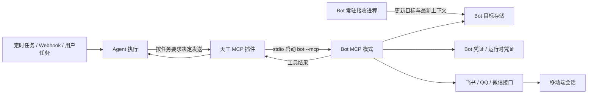

# Bot MCP 主动推送设计方案

> 状态：方案已确认，飞书首期实现完成，待真实投递验证
> 日期：2026-07-24
> 关联范围：`bots/`、`crates/tiangong-bots`、`src-tauri`、`tiangong-scheduler`；复用现有 MCP 插件，不修改其内部模型

## 1. 结论

方案可行，且与当前架构方向一致，但需要准确区分两个能力：

- MCP 负责把 Bot 的“发送消息”能力暴露为 Agent 可调用工具。
- 定时任务、Webhook、用户消息或后台事件负责唤醒 Agent。MCP 本身不会主动唤醒 Agent，也不是消息队列。

因此完整链路应为：触发源创建一次 Agent 执行，Agent 根据任务要求决定是否调用 Bot MCP，Bot MCP 再调用对应平台接口向移动端发送消息。

Bot 注册完成后并不会自动知道收件人。首期要求用户先从目标移动端会话向 Bot 发送至少一条消息，让 Bot 获得平台会话标识；随后用户还要在移动端控制页显式允许该会话接收主动推送。

首期推荐让每个 Bot 制品增加 `--mcp` stdio 模式，并通过 `--mcp generate` 输出普通 MCP 注册配置。移动端控制页只在 Bot 声明支持 MCP 时显示快速注册按钮，由用户显式注册，不把 MCP 生命周期与 Bot 常驻进程绑定。现有 MCP 客户端已经支持 stdio，通知推送频率通常较低，单次启动进程的开销可以接受；HTTP 模式会额外引入端口发现和本地鉴权，当前没有必要。

平台层面不能承诺三端能力完全一致：

| 平台 | 当前代码具备的发送条件 | 主动推送判断 | 首期建议 |
| --- | --- | --- | --- |
| 飞书 | 使用稳定的 `chat_id` 创建消息，不依赖原消息编号 | 可行，受机器人权限、会话成员关系和平台限流约束 | 首个完整落地平台 |
| QQ | 当前发送请求必须携带入站 `msg_id` | 需验证账号是否开放主动消息、无 `msg_id` 调用方式及配额；验证前只能视为回复窗口内发送 | 接入受限 MCP，保存最近消息上下文并标记 `reply_window` |
| 微信 iLink | 发送必须携带入站消息的 `context_token` | 可复用时长和跨轮次有效性需要真实验证，暂不能承诺任意时刻发送 | 接入受限 MCP，保存最近令牌并标记 `reply_window` |

## 2. 现状与缺口

当前 Bot 是独立常驻进程，收到外部消息后调用天工 `POST /api/v1/messages`，再把同步响应发回原会话。这个模型天然支持“收到一条、回复一条”，但缺少独立出站入口。

现有基础能力已经满足大部分前置条件：

- MCP 插件支持 stdio 和 HTTP，并能把 MCP 工具动态暴露给 Agent。
- Desktop 内嵌 Server 与 Core 共用同一个 MCP 插件实例。
- 定时任务已经能够向指定会话投递结构化任务消息。
- Bot 管理已经具备安装、配置、启动、停止、升级和崩溃重启能力。
- 飞书、QQ、微信 Bot 已经分别实现平台发送函数。

本方案的主要代码核对依据：

- [Bot 开发协议](../bots/README.md)：当前 Bot 只声明配置、扫码和入站转发协议。
- [MCP 客户端](../crates/plugins/tiangong-plugin-mcp/src/client.rs)：stdio 调用会启动子进程，HTTP 使用独立传输。
- [MCP 管理](../crates/plugins/tiangong-plugin-mcp/src/management.rs)：注册会写入 `mcp.json` 并立即探测工具。
- [Server MCP API](../crates/tiangong-server/src/api/mcp.rs)：当前 Server 只提供 MCP 列表查询，没有供 Bot 自助注册的接口。
- [定时任务执行](../crates/tiangong-scheduler/src/executor.rs)：当前只把任务消息稳定投递给会话，不等待 Agent 最终结果。
- [飞书发送](../bots/feishu/src/main.rs)、[QQ 发送](../bots/qq/src/main.rs)、[微信发送](../bots/weixin/src/ilink.rs)：三端分别依赖 `chat_id`、`msg_id` 和 `context_token`。
- [项目计划](../PLAN.md)与[需求整理](requirements.md)：已经包含定时任务结果通过 MCP/Skill 自主处理及后续推送到指定通道的方向。

仍缺少以下闭环：

1. Bot 制品没有声明或实现 MCP 能力。
2. Bot 没有生成普通 MCP 注册配置的统一命令。
3. Bot 没有持久化“允许主动推送的目标会话”。
4. 当前 MCP 配置会持久化环境变量，直接复用会造成 Bot 凭证在 `mcp.json` 中重复保存。
5. QQ 和微信当前发送路径依赖入站消息上下文，不能直接等同于长期主动发送。
6. 定时任务只负责触发 Agent，不保证模型一定调用发送工具，也不等待最终投递结果。
7. Bot 注册信息本身不包含移动端收件人，必须先发现并授权目标。

## 3. 目标与非目标

### 3.1 目标

- 支持 Agent 在一次有效执行中主动调用指定 Bot 向已授权目标发送文本、图片或文件。
- Bot 自己持有平台凭证、目标地址和平台发送逻辑，天工主程序不感知飞书、QQ、微信专属字段。
- 支持用户从 Bot 配置页快速生成并注册普通 MCP。
- 支持定时任务或 Webhook 触发 Agent 后，由 Agent 按任务要求决定是否发送。
- 对相同幂等键避免重复发送，并明确返回已受理、已拒绝或结果未知。
- 旧 Bot 不声明 MCP 能力时保持现有行为不变。

### 3.2 首期非目标

- 不让 MCP 自身承担定时触发或事件唤醒。
- 不强制把每次定时任务结果都投递到 IM。
- 不支持广播、批量联系人、群发和任意原始平台 ID。
- 不支持音频和视频主动推送。
- 不承诺平台接口返回成功等于移动设备已经展示或用户已经阅读。
- 不在首期把 Bot 管理扩展到独立 Server/CLI 模式，先完成当前 Desktop Bot 管理闭环。

## 4. 总体架构



这里保留现有职责边界：

- 天工分别管理 Bot 和普通 MCP 配置，两者生命周期相互独立；主程序不解释平台地址与上下文令牌。
- Bot 负责发现目标、判断该目标当前是否支持主动发送、调用平台接口并解释平台错误。
- Agent 负责依据用户或任务意图决定是否发送以及发送什么内容。

## 5. Bot 协议扩展

### 5.1 能力声明

在现有 `--describe` 输出中增加可选能力字段，保持 `schema_version: 1` 的向后兼容：

```json
{
  "schema_version": 1,
  "artifact_id": "feishu",
  "config_schema": [],
  "capabilities": {
    "mcp": {
      "protocol_version": 1
    }
  }
}
```

安装时缓存完整描述信息；现有只缓存配置字段的 `schema.json` 继续保留，新增完整的 `description.json`，避免破坏旧数据。未声明 `mcp` 的旧 Bot 不显示 MCP 注册按钮。

### 5.2 MCP 运行模式

Bot 收到 `--mcp generate` 时只向 stdout 输出普通 MCP 注册配置并退出：

```json
{
  "schema_version": 1,
  "name": "bot-feishu",
  "transport": "stdio",
  "command": "/已安装的/bot",
  "args": ["--mcp"],
  "enabled": true,
  "tags": ["bot-outbound"]
}
```

主程序校验名称必须为 `bot-<bot-id>`、transport 必须为 `stdio`、args 必须为 `["--mcp"]`、enabled 必须为 `true`，并校验 command 与当前已安装制品的真实路径完全一致，不允许借生成配置注册其他命令。

Bot 收到 `--mcp` 时：

1. stdout 只运行标准 MCP stdio 协议，不输出普通日志。
2. 日志写 stderr。
3. 从 Bot 自己的运行目录读取凭证、目标和投递记录。
4. 扫码凭证从运行目录的 `credentials.json` 读取；手工凭证只读当前实例已有的 `bots.json` 配置，不复制到 MCP 配置。
5. MCP 会话结束后进程正常退出。

各 Bot 使用与天工当前 MCP 客户端兼容的 `rmcp` 版本，避免自行实现 JSON-RPC 细节。

### 5.3 MCP 工具

飞书、QQ 和微信均提供四个工具；QQ 和微信的发送工具只在最近入站消息形成的平台回复窗口内尝试发送。

#### `list_push_targets`

只读工具，返回用户已经允许推送的目标，不返回真实平台 ID、凭证或上下文令牌。

```json
{
  "targets": [
    {
      "target_id": "scru128",
      "label": "飞书私聊，最近使用于 2026-07-24 10:30:00",
      "kind": "direct",
      "availability": "ready",
      "last_seen_at": "2026-07-24 10:30:00",
      "limitation": null
    }
  ]
}
```

`availability` 取值：

- `ready`：Bot 判断当前可以主动发送。
- `reply_window`：只能在平台允许的回复窗口内尝试发送。
- `unavailable`：上下文缺失、过期或平台不支持。
- `unknown`：尚未完成真实能力验证。

#### `send_text_message`

有外部副作用的工具，只接受 Bot 生成的 `target_id`，不接受原始 `chat_id`、OpenID 或用户 ID。

```json
{
  "target_id": "scru128",
  "text": "任务已完成",
  "idempotency_key": "本次任务稳定编号"
}
```

返回值：

```json
{
  "delivery_id": "scru128",
  "status": "accepted",
  "platform_message_id": "可选的平台消息编号",
  "sent_at": "2026-07-24 10:31:00",
  "retryable": false,
  "message": "平台已受理消息"
}
```

`status` 只使用：

- `accepted`：平台接口明确受理，不代表已读。
- `rejected`：明确未发送，可根据 `retryable` 判断是否重试。
- `unknown`：请求超时或进程在结果落盘前中断，不能自动重发，避免重复消息。

#### `send_image_message`

向已授权目标发送一张本地图片。工具只接受本地文件路径，不接受远程 URL、data URI 或平台 `image_key`。

```json
{
  "target_id": "scru128",
  "file_path": "/Users/example/.tiangong/media/images/result.png",
  "idempotency_key": "本次任务稳定编号"
}
```

图片必须是当前 MCP 工作目录或 `~/.tiangong/media` 内的真实普通文件，解析真实路径后仍需位于允许目录中。支持 PNG、JPEG、GIF 和 WebP，大小不超过 10 MiB。Bot 使用自身凭证上传图片并发送，不向模型返回 `image_key`。

#### `send_file_message`

向已授权目标发送一个本地文件。工具只接受本地文件路径，不接受远程 URL 或平台 `file_key`，飞书展示名称取本地文件名。

```json
{
  "target_id": "scru128",
  "file_path": "/Users/example/project/report.pdf",
  "idempotency_key": "本次任务稳定编号"
}
```

文件必须是当前 MCP 工作目录或 `~/.tiangong/media` 内的真实普通文件，大小不超过 30 MiB。Bot 按扩展名映射飞书文件类型，其他格式使用通用文件类型；上传和发送均使用 Bot 自身凭证，不向模型返回 `file_key`。

图片和文件工具复用文本工具的目标授权、幂等投递和状态返回规则。上传成功但发送结果未知时返回 `unknown`，相同幂等键不自动重试，避免重复消息。

## 6. 推送目标管理

### 6.1 目标发现

常驻 Bot 每次收到外部消息时，按平台会话更新目标记录：

- 飞书保存 `chat_id`。
- QQ 保存目标类型、用户或群 OpenID，以及平台主动发送所需的最新上下文。
- 微信保存目标用户、群信息和最新 `context_token`。

目标记录保存在 `~/.tiangong/bots/<bot-id>/targets.json`，文件权限限制为当前用户可读写。常驻 Bot 和目标管理子进程执行“读取、修改、写回”时必须使用跨进程文件锁，成功取得锁后再通过临时文件加原子替换写入，避免并发更新互相覆盖。MCP 子进程只读取目标快照。目标 ID 使用 `scru128`，时间使用本地时间。

### 6.2 用户授权

发现目标不等于允许推送。移动端控制页需要增加“推送目标”管理：

1. 展示 Bot 返回的已发现目标、类型、最近使用时间和可用状态。
2. 用户显式启用某个目标后，MCP 的 `list_push_targets` 才能看到它。
3. 用户可以随时停用目标，停用后 `send_text_message` 必须拒绝发送。

主程序通过通用子进程管理命令读取和修改授权状态，例如 `--push-target-list` 和 `--push-target-set-enabled`。协议只处理通用目标视图，不包含平台专属字段。

群聊目标默认关闭。首期不提供“一键全部启用”。

## 7. MCP 注册与生命周期

当 Bot 声明 `mcp` 能力时，移动端控制页显示 MCP 快速注册按钮。点击后 Desktop 执行 `bot --mcp generate`，完成安全校验，再调用现有 MCP 插件的普通注册接口。

- MCP server 名称固定为 `bot-<bot-id>`。
- 生成配置与已有 MCP 同名但内容不同时拒绝覆盖。
- 注册结果写入现有 `mcp.json`，后续启用、停用、编辑和删除都在 MCP 页面完成。
- Bot 常驻进程停止后，普通 MCP 仍可按需启动；它直接读取持久目标和凭证，不依赖常驻进程内存。
- Bot 升级后若启动参数发生变化，用户重新点击注册时按同名冲突处理，首期不自动覆盖现有 MCP。

该方式不修改 MCP 插件内部模型，也不引入托管来源、激活租约或运行时凭证覆盖。MCP 探测失败不会影响 Bot 原有入站收发。

## 8. 定时任务衔接

现有定时任务已经能唤醒 Agent，保持“由 Agent 决定如何处理结果”的规则，不新增 Server 强制投递逻辑。

为了支持幂等发送，定时任务构造的消息中增加本次 `run_id`。任务要求发送时，Agent把稳定的运行编号作为 `idempotency_key` 的一部分传给 MCP。

同一幂等键的处理规则：

1. 首次调用创建 `delivery_id` 并记录 `pending`。
2. 平台明确受理后记录 `accepted` 和平台消息编号。
3. 重复调用直接返回已有结果，不再次调用平台。
4. 请求超时或崩溃边界无法判断时记录 `unknown`，不自动重发。

投递记录按幂等键哈希后保存到 Bot 运行目录，避免把外部字符串直接作为文件名。首次创建记录必须使用排他创建，同一键只能有一个 MCP 子进程取得发送权；其他进程读取已有状态并直接返回。状态更新继续使用同目录临时文件加原子替换。

该机制只能避免同一键重复调用，不能在平台不支持幂等的情况下提供严格的“只发送一次”保证。

后台任务使用受监督会话时，MCP 调用仍会进入现有审批流程，可能无法无人值守完成。首期不绕过全局权限系统：需要自动推送的任务必须绑定允许工具执行的会话，同时目标本身还必须经过用户授权。这两个条件缺一不可。

## 9. 平台适配

### 9.1 飞书

复用现有获取 access token、创建消息、文本卡片和图片上传逻辑，并增加文件上传。目标以 `chat_id` 保存，Bot 不在会话内、权限不足、文件不符合平台限制或平台限流时返回明确错误。

飞书作为首期验收平台，因为当前发送函数不依赖原消息编号，最接近真正主动发送。

### 9.2 QQ

当前实现所有文本和文件发送都携带入站 `msg_id`。受限 MCP 保存每个私聊或群聊目标的最近 `msg_id`，只向已授权目标提供文本、图片和文件发送，并继续验证：

- 私聊和群聊主动消息对应的请求形式。
- 是否允许不携带 `msg_id`，或是否需要 `event_id`。
- 主动消息权限、频率、时间窗口和平台审核限制。
- 文本与富媒体主动发送是否使用相同规则。

在验证完成前，QQ 目标固定返回 `reply_window`，不能向 Agent 宣称 `ready`。目标缺少最近 `msg_id` 时直接拒绝发送，不尝试构造或省略消息上下文。

### 9.3 微信 iLink

当前 `sendmessage` 必须携带入站 `context_token`。受限 MCP 保存每个私聊或群聊目标的最近令牌，并复用现有文本、本地图片和文件发送流程；同时继续真实验证最新令牌在不同时间间隔、私聊和群聊中的复用行为。

微信目标固定返回 `reply_window`，明确命名为“回复窗口内发送”，不能包装成长期主动推送。缺少令牌时直接拒绝；平台确认令牌过期时返回拒绝结果，等待下一条入站消息刷新。

## 10. 安全与限制

- 只有用户显式启用的目标才能被发送工具访问。
- 模型和 MCP 工具结果不暴露平台真实地址、凭证和 `context_token`。
- Bot MCP command 固定为已安装制品路径，能力声明不能指定任意命令。
- Bot 凭证只存在于现有 Bot 存储和进程环境，不复制到 MCP 配置。
- 每个目标实施单条长度限制和速率限制，具体上限由平台适配器决定。
- 图片和文件只允许读取当前 MCP 工作目录或 `~/.tiangong/media`，真实路径解析后必须仍在允许目录内；拒绝目录、符号链接逃逸、空文件和超限文件。
- 工具禁止广播，群聊目标默认关闭。
- 日志只记录 `delivery_id`、目标的脱敏标识、状态和平台错误码，不记录完整正文和凭证。
- 外部接口超时视为结果未知，不能由模型无条件重试。

## 11. 实施顺序

### 阶段一：平台能力验证

1. 使用真实飞书会话验证脱离原消息编号发送文本。
2. 使用真实 QQ 私聊和群聊验证主动消息请求与限制。
3. 使用真实微信私聊和群聊验证 `context_token` 可复用范围。
4. 固化三端能力状态和错误映射。

### 阶段二：通用 Bot 协议

1. 扩展 `--describe` 的可选 `mcp` 能力。
2. 缓存完整 `description.json`，兼容现有 `schema.json`。
3. 增加 `--mcp generate` 配置生成协议及安全校验。
4. 增加通用目标存储和目标授权管理命令。
5. 增加 `--mcp` stdio 入口及文本、图片、文件发送工具。

### 阶段三：Desktop 注册

1. 在移动端控制页按能力声明显示 MCP 快速注册按钮。
2. 复用现有普通 MCP 注册与健康检查。
3. 在移动端控制页增加目标授权界面。

### 阶段四：飞书闭环

1. 写入飞书目标记录。
2. 实现飞书 `list_push_targets`、`send_text_message`、`send_image_message` 和 `send_file_message`。
3. 接入幂等投递记录。
4. 用真实定时任务完成移动端收取验证。

### 阶段五：受限平台接入

1. 为 QQ 和微信接入目标发现、授权、MCP 配置生成与 stdio 服务。
2. 保存最近入站 `msg_id` 或 `context_token`，提供文本、图片和文件工具。
3. 两个平台固定展示 `reply_window`，不通过重试、伪造或省略上下文绕过平台限制。
4. 完成真实能力验证后，再决定是否调整单个平台的可用状态。

## 12. 验收标准

- 未声明 MCP 能力的旧 Bot 安装、配置、收发消息行为不变。
- 支持能力的 Bot 显示 MCP 快速注册按钮，注册后出现对应 MCP 工具。
- 新注册 Bot 在尚未收到移动端消息时没有推送目标，移动端发来消息并经用户授权后目标才可用。
- 用户可以看到已发现目标，并且只有显式启用的目标对 Agent 可见。
- 定时任务触发后，Agent 可以调用飞书 Bot MCP，真实移动端收到文本、图片和文件。
- Agent 可以调用 QQ 和微信 Bot MCP，在平台回复窗口仍有效时向已授权目标发送文本、图片和文件。
- 同一 `idempotency_key` 重复调用不会产生第二条消息。
- 平台拒绝、限流、上下文过期和超时均返回可区分状态。
- `mcp.json`、工具结果和日志中不出现 Bot 凭证明文或平台上下文令牌。
- 应用重启后普通 MCP 注册状态保持不变，Bot 停止不影响已注册 MCP 按需发送。
- QQ 和微信只有在真实接口验证通过后才能展示为 `ready`。
- Rust 格式、`cargo check` 或 `cargo clippy`、三个 Bot 独立构建及前端 `yarn build` 全部通过。
- 至少完成一次真实飞书定时推送、重复调用防重和停止后拒绝发送验证。

## 13. 主要风险

| 风险 | 影响 | 处理 |
| --- | --- | --- |
| 把 MCP 当成触发器 | 没有 Agent 执行时不会发生任何推送 | 明确由 Cron、Webhook 或用户任务触发 |
| 平台不支持长期主动消息 | QQ 或微信无法达到飞书同等能力 | 真实验证后按 `ready`、`reply_window`、`unavailable` 分级 |
| 模型没有调用发送工具 | 定时任务执行了，但移动端没有消息 | 任务描述明确发送要求，保留工具结果和投递日志，不在 Server 强制投递 |
| 网络超时导致结果不确定 | 自动重试可能重复消息 | 返回 `unknown`，相同幂等键不自动重发 |
| 凭证写入 MCP 配置 | 扩大敏感信息暴露面 | Bot 从现有实例配置读取，不持久化到 `mcp.json` |
| Bot 生成任意 MCP 命令 | 可能借快速注册执行其他程序 | 校验名称、stdio transport 和 command 的真实路径必须与当前制品一致 |
| stdio 每次调用启动进程 | 高频发送时延迟和资源消耗上升 | 首期接受；只有真实负载证明不足时再评估常驻 HTTP MCP |
| 后台会话等待审批 | 无人值守任务无法完成推送 | 自动任务绑定允许工具执行的会话，不绕过现有权限系统 |

## 14. 最终建议

采用 Bot MCP 方案，但把它定义为“Bot 出站工具协议”，不要定义为“主动推送触发协议”。首期以 `bot --mcp generate` 普通注册、`bot --mcp` stdio、显式目标授权、文本、图片和文件发送及飞书真实闭环为边界。QQ 与微信先完成平台能力验证，再决定提供长期主动推送还是仅提供回复窗口内发送。

这个方案能够复用现有 MCP、Bot 管理和定时任务体系，同时保持平台逻辑仍由独立 Bot 制品负责。相比在 Server 中新增统一 IM 发送接口，它对现有架构的侵入更小，也不会让主程序重新依赖具体平台协议。
