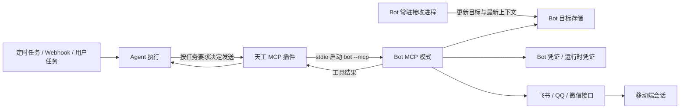

# Bot MCP 主动推送设计方案

> 状态：方案评估，尚未实施
> 日期：2026-07-24
> 关联范围：`bots/`、`crates/tiangong-bots`、`crates/plugins/tiangong-plugin-mcp`、`src-tauri`、`tiangong-scheduler`

## 1. 结论

方案可行，且与当前架构方向一致，但需要准确区分两个能力：

- MCP 负责把 Bot 的“发送消息”能力暴露为 Agent 可调用工具。
- 定时任务、Webhook、用户消息或后台事件负责唤醒 Agent。MCP 本身不会主动唤醒 Agent，也不是消息队列。

因此完整链路应为：触发源创建一次 Agent 执行，Agent 根据任务要求决定是否调用 Bot MCP，Bot MCP 再调用对应平台接口向移动端发送消息。

Bot 注册完成后并不会自动知道收件人。首期要求用户先从目标移动端会话向 Bot 发送至少一条消息，让 Bot 获得平台会话标识；随后用户还要在移动端控制页显式允许该会话接收主动推送。

首期推荐让每个 Bot 制品增加 `--mcp` stdio 模式，不推荐首期在 Bot 内启动 HTTP MCP 服务。现有 MCP 客户端已经支持 stdio，通知推送频率通常较低，单次启动进程的开销可以接受；HTTP 模式会额外引入端口发现、本地鉴权和生命周期同步，当前没有必要。

平台层面不能承诺三端能力完全一致：

| 平台 | 当前代码具备的发送条件 | 主动推送判断 | 首期建议 |
| --- | --- | --- | --- |
| 飞书 | 使用稳定的 `chat_id` 创建消息，不依赖原消息编号 | 可行，受机器人权限、会话成员关系和平台限流约束 | 首个完整落地平台 |
| QQ | 当前发送请求必须携带入站 `msg_id` | 需验证账号是否开放主动消息、无 `msg_id` 调用方式及配额；验证前只能视为回复窗口内发送 | 完成真实接口验证后接入 |
| 微信 iLink | 发送必须携带入站消息的 `context_token` | 可复用时长和跨轮次有效性需要真实验证，暂不能承诺任意时刻发送 | 先作为受限能力，不作为首期验收平台 |

## 2. 现状与缺口

当前 Bot 是独立常驻进程，收到外部消息后调用天工 `POST /api/v1/messages`，再把同步响应发回原会话。这个模型天然支持“收到一条、回复一条”，但缺少独立出站入口。

现有基础能力已经满足大部分前置条件：

- MCP 插件支持 stdio 和 HTTP，并能把 MCP 工具动态暴露给 Agent。
- Desktop 内嵌 Server 与 Core 共用同一个 MCP 插件实例。
- 定时任务已经能够向指定会话投递结构化任务消息。
- Bot 管理已经具备安装、配置、启动、停止、升级和崩溃重启能力。
- 飞书、QQ、微信 Bot 已经分别实现平台发送函数。

本方案的主要代码核对依据：

- [Bot 开发协议](../bots/README.md)：当前 Bot 只声明配置、扫码和入站转发协议。
- [MCP 客户端](../crates/plugins/tiangong-plugin-mcp/src/client.rs)：stdio 调用会启动子进程，HTTP 使用独立传输。
- [MCP 管理](../crates/plugins/tiangong-plugin-mcp/src/management.rs)：注册会写入 `mcp.json` 并立即探测工具。
- [Server MCP API](../crates/tiangong-server/src/api/mcp.rs)：当前 Server 只提供 MCP 列表查询，没有供 Bot 自助注册的接口。
- [定时任务执行](../crates/tiangong-scheduler/src/executor.rs)：当前只把任务消息稳定投递给会话，不等待 Agent 最终结果。
- [飞书发送](../bots/feishu/src/main.rs)、[QQ 发送](../bots/qq/src/main.rs)、[微信发送](../bots/weixin/src/ilink.rs)：三端分别依赖 `chat_id`、`msg_id` 和 `context_token`。
- [项目计划](../PLAN.md)与[需求整理](requirements.md)：已经包含定时任务结果通过 MCP/Skill 自主处理及后续推送到指定通道的方向。

仍缺少以下闭环：

1. Bot 制品没有声明或实现 MCP 能力。
2. Bot 启停与 MCP 注册、启用状态没有关联。
3. Bot 没有持久化“允许主动推送的目标会话”。
4. 当前 MCP 配置会持久化环境变量，直接复用会造成 Bot 凭证在 `mcp.json` 中重复保存。
5. QQ 和微信当前发送路径依赖入站消息上下文，不能直接等同于长期主动发送。
6. 定时任务只负责触发 Agent，不保证模型一定调用发送工具，也不等待最终投递结果。
7. Bot 注册信息本身不包含移动端收件人，必须先发现并授权目标。

## 3. 目标与非目标

### 3.1 目标

- 支持 Agent 在一次有效执行中主动调用指定 Bot 向已授权目标发送文本消息。
- Bot 自己持有平台凭证、目标地址和平台发送逻辑，天工主程序不感知飞书、QQ、微信专属字段。
- Bot 启动后自动注册其托管 MCP，停止后不再允许新的主动发送。
- 支持定时任务或 Webhook 触发 Agent 后，由 Agent 按任务要求决定是否发送。
- 对相同幂等键避免重复发送，并明确返回已受理、已拒绝或结果未知。
- 旧 Bot 不声明 MCP 能力时保持现有行为不变。

### 3.2 首期非目标

- 不让 MCP 自身承担定时触发或事件唤醒。
- 不强制把每次定时任务结果都投递到 IM。
- 不支持广播、批量联系人、群发和任意原始平台 ID。
- 不支持图片、文件、音频和视频主动推送，首期只发送文本。
- 不承诺平台接口返回成功等于移动设备已经展示或用户已经阅读。
- 不在首期把 Bot 管理扩展到独立 Server/CLI 模式，先完成当前 Desktop Bot 管理闭环。

## 4. 总体架构



这里保留现有职责边界：

- 天工只管理 Bot 和 MCP 生命周期，不解释平台地址与上下文令牌。
- Bot 负责发现目标、判断该目标当前是否支持主动发送、调用平台接口并解释平台错误。
- Agent 负责依据用户或任务意图决定是否发送以及发送什么内容。

## 5. Bot 协议扩展

### 5.1 能力声明

在现有 `--describe` 输出中增加可选能力字段，保持 `schema_version: 1` 的向后兼容：

```json
{
  "schema_version": 1,
  "artifact_id": "feishu",
  "config_schema": [],
  "capabilities": {
    "outbound_mcp": {
      "transport": "stdio",
      "args": ["--mcp"],
      "protocol_version": 1
    }
  }
}
```

主程序始终使用已经安装并校验过的 Bot 制品路径作为 MCP `command`，不接受 Bot 返回自定义可执行路径。安装时需要缓存完整描述信息；现有只缓存配置字段的 `schema.json` 继续保留，新增完整的 `description.json`，避免破坏旧数据。

### 5.2 MCP 运行模式

Bot 收到 `--mcp` 时：

1. stdout 只运行标准 MCP stdio 协议，不输出普通日志。
2. 日志写 stderr。
3. 从 Bot 自己的运行目录读取凭证、目标和投递记录。
4. 手工配置产生的凭证由主程序通过仅在内存中的运行时环境覆盖注入。
5. MCP 会话结束后进程正常退出。

各 Bot 使用与天工当前 MCP 客户端兼容的 `rmcp` 版本，避免自行实现 JSON-RPC 细节。

### 5.3 MCP 工具

首期只提供两个工具。

#### `list_push_targets`

只读工具，返回用户已经允许推送的目标，不返回真实平台 ID、凭证或上下文令牌。

```json
{
  "targets": [
    {
      "target_id": "scru128",
      "label": "飞书私聊，最近使用于 2026-07-24 10:30:00",
      "kind": "direct",
      "availability": "ready",
      "last_seen_at": "2026-07-24 10:30:00",
      "limitation": null
    }
  ]
}
```

`availability` 取值：

- `ready`：Bot 判断当前可以主动发送。
- `reply_window`：只能在平台允许的回复窗口内尝试发送。
- `unavailable`：上下文缺失、过期或平台不支持。
- `unknown`：尚未完成真实能力验证。

#### `send_text_message`

有外部副作用的工具，只接受 Bot 生成的 `target_id`，不接受原始 `chat_id`、OpenID 或用户 ID。

```json
{
  "target_id": "scru128",
  "text": "任务已完成",
  "idempotency_key": "本次任务稳定编号"
}
```

返回值：

```json
{
  "delivery_id": "scru128",
  "status": "accepted",
  "platform_message_id": "可选的平台消息编号",
  "sent_at": "2026-07-24 10:31:00",
  "retryable": false,
  "message": "平台已受理消息"
}
```

`status` 只使用：

- `accepted`：平台接口明确受理，不代表已读。
- `rejected`：明确未发送，可根据 `retryable` 判断是否重试。
- `unknown`：请求超时或进程在结果落盘前中断，不能自动重发，避免重复消息。

## 6. 推送目标管理

### 6.1 目标发现

常驻 Bot 每次收到外部消息时，按平台会话更新目标记录：

- 飞书保存 `chat_id`。
- QQ 保存目标类型、用户或群 OpenID，以及平台主动发送所需的最新上下文。
- 微信保存目标用户、群信息和最新 `context_token`。

目标记录保存在 `~/.tiangong/bots/<bot-id>/targets.json`，文件权限限制为当前用户可读写。常驻 Bot 和目标管理子进程执行“读取、修改、写回”时必须使用跨进程文件锁，成功取得锁后再通过临时文件加原子替换写入，避免并发更新互相覆盖。MCP 子进程只读取目标快照。目标 ID 使用 `scru128`，时间使用本地时间。

### 6.2 用户授权

发现目标不等于允许推送。移动端控制页需要增加“推送目标”管理：

1. 展示 Bot 返回的已发现目标、类型、最近使用时间和可用状态。
2. 用户显式启用某个目标后，MCP 的 `list_push_targets` 才能看到它。
3. 用户可以随时停用目标，停用后 `send_text_message` 必须拒绝发送。

主程序通过通用子进程管理命令读取和修改授权状态，例如 `--push-target-list` 和 `--push-target-set-enabled`。协议只处理通用目标视图，不包含平台专属字段。

群聊目标默认关闭。首期不提供“一键全部启用”。

## 7. MCP 托管与生命周期

### 7.1 托管注册

当 Bot 声明 `outbound_mcp` 时，Desktop 在 Bot 启动流程中自动协调 MCP 插件：

- MCP server 名称：`bot-<bot-id>`。
- transport：`stdio`。
- command：已校验的本地 Bot 制品路径。
- args：能力声明中的固定 `--mcp` 参数。
- owner：记录为该 Bot 托管，避免覆盖或删除用户手工创建的同名 MCP。

`McpServerConfig` 增加可选的托管来源字段，旧配置缺失时视为用户管理。出现同名但来源不同的配置时停止自动覆盖，并向用户明确报告冲突。Bot 托管条目在通用 MCP 设置中只读展示，编辑、启停和删除统一回到 Bot 管理入口，避免两个页面互相覆盖状态。

托管条目还需要 Desktop 运行期激活租约。只有 Desktop 已启动对应 Bot 并注入当前租约时，该 MCP 才进入有效配置和工具列表；单独启动 Server 或 CLI 时没有租约，即使磁盘上存在托管元数据也不得启动 Bot MCP。这可以避免 Desktop 首期能力意外扩展到尚未支持的运行模式。

### 7.2 凭证注入

不把 Bot 手工配置凭证复制到 `~/.tiangong/mcp.json`。MCP 插件增加按 server 名称保存的内存环境覆盖：

- Bot 启动时由 `src-tauri` 根据现有 schema 和 Bot 配置生成环境变量并注入覆盖。
- MCP 探测和工具调用时，把运行时覆盖与普通 MCP env 合并后再启动子进程。
- Bot 停止、删除或应用退出时清除覆盖。
- 应用重启后由自动启动流程重新构建，不需要持久化。

扫码所得凭证仍由 Bot 从自身目录的 `credentials.json` 读取。

### 7.3 状态变化

| Bot 操作 | MCP 行为 |
| --- | --- |
| 启动 | 注入运行时环境，创建或更新托管 MCP，启用并探测工具 |
| 停止 | 先禁止新的 MCP 调用，再停止 Bot，并清除运行时环境 |
| 删除配置 | 停止 Bot，删除对应托管 MCP；保留 Bot 程序、凭证和目标文件，符合现有删除语义 |
| 升级 | 先禁用 MCP，再停止和替换制品；重新读取能力描述，升级后仍保持停止 |
| 崩溃重启 | 托管 MCP 保持启用；发送工具从持久目标和凭证恢复，不依赖常驻进程内存 |

MCP 探测失败不应让已有入站 Bot 完全不可用。Bot 可以保持运行，但界面必须显示“接收正常，主动推送不可用”，并提供重试入口。

## 8. 定时任务衔接

现有定时任务已经能唤醒 Agent，保持“由 Agent 决定如何处理结果”的规则，不新增 Server 强制投递逻辑。

为了支持幂等发送，定时任务构造的消息中增加本次 `run_id`。任务要求发送时，Agent把稳定的运行编号作为 `idempotency_key` 的一部分传给 MCP。

同一幂等键的处理规则：

1. 首次调用创建 `delivery_id` 并记录 `pending`。
2. 平台明确受理后记录 `accepted` 和平台消息编号。
3. 重复调用直接返回已有结果，不再次调用平台。
4. 请求超时或崩溃边界无法判断时记录 `unknown`，不自动重发。

投递记录按幂等键哈希后保存到 Bot 运行目录，避免把外部字符串直接作为文件名。首次创建记录必须使用排他创建，同一键只能有一个 MCP 子进程取得发送权；其他进程读取已有状态并直接返回。状态更新继续使用同目录临时文件加原子替换。

该机制只能避免同一键重复调用，不能在平台不支持幂等的情况下提供严格的“只发送一次”保证。

后台任务使用受监督会话时，MCP 调用仍会进入现有审批流程，可能无法无人值守完成。首期不绕过全局权限系统：需要自动推送的任务必须绑定允许工具执行的会话，同时目标本身还必须经过用户授权。这两个条件缺一不可。

## 9. 平台适配

### 9.1 飞书

复用现有获取 access token、创建消息和文本卡片发送逻辑。目标以 `chat_id` 保存，Bot 不在会话内、权限不足或平台限流时返回明确错误。

飞书作为首期验收平台，因为当前发送函数不依赖原消息编号，最接近真正主动发送。

### 9.2 QQ

当前实现所有文本和文件发送都携带入站 `msg_id`。接入前必须用真实机器人验证：

- 私聊和群聊主动消息对应的请求形式。
- 是否允许不携带 `msg_id`，或是否需要 `event_id`。
- 主动消息权限、频率、时间窗口和平台审核限制。
- 文本与富媒体主动发送是否使用相同规则。

在验证完成前，QQ 目标只返回 `reply_window` 或 `unknown`，不能向 Agent 宣称 `ready`。

### 9.3 微信 iLink

当前 `sendmessage` 必须携带入站 `context_token`。接入前需要真实验证最新令牌在不同时间间隔、私聊和群聊中的复用行为。

如果令牌只能用于短期回复，微信能力应明确命名为“回复窗口内发送”，不能包装成长期主动推送。令牌过期后目标变为 `unavailable`，等待下一条入站消息刷新。

## 10. 安全与限制

- 只有用户显式启用的目标才能被发送工具访问。
- 模型和 MCP 工具结果不暴露平台真实地址、凭证和 `context_token`。
- Bot MCP command 固定为已安装制品路径，能力声明不能指定任意命令。
- Bot 凭证只存在于现有 Bot 存储和进程环境，不复制到 MCP 配置。
- 每个目标实施单条长度限制和速率限制，具体上限由平台适配器决定。
- 工具禁止广播，群聊目标默认关闭。
- 日志只记录 `delivery_id`、目标的脱敏标识、状态和平台错误码，不记录完整正文和凭证。
- 外部接口超时视为结果未知，不能由模型无条件重试。

## 11. 实施顺序

### 阶段一：平台能力验证

1. 使用真实飞书会话验证脱离原消息编号发送文本。
2. 使用真实 QQ 私聊和群聊验证主动消息请求与限制。
3. 使用真实微信私聊和群聊验证 `context_token` 可复用范围。
4. 固化三端能力状态和错误映射。

### 阶段二：通用 Bot 协议

1. 扩展 `--describe` 的可选 `outbound_mcp` 能力。
2. 缓存完整 `description.json`，兼容现有 `schema.json`。
3. 增加通用目标存储和目标授权管理命令。
4. 增加 `--mcp` stdio 入口及两个基础工具。

### 阶段三：Desktop 托管

1. 在 `src-tauri` 协调 Bot 与 MCP 生命周期。
2. 增加 MCP 托管来源、Desktop 激活租约和运行时环境覆盖。
3. 在移动端控制页增加目标授权和推送健康状态。
4. 处理启动、停止、删除、升级和崩溃恢复的一致性。

### 阶段四：飞书闭环

1. 写入飞书目标记录。
2. 实现飞书 `list_push_targets` 和 `send_text_message`。
3. 接入幂等投递记录。
4. 用真实定时任务完成移动端收取验证。

### 阶段五：受限平台接入

根据阶段一的结果分别接入 QQ 和微信；若平台不支持长期主动发送，则保留受限状态，不通过重试或伪造上下文绕过平台限制。

## 12. 验收标准

- 未声明 MCP 能力的旧 Bot 安装、配置、收发消息行为不变。
- 支持能力的 Bot 启动后自动出现对应 MCP 工具，停止后工具不可继续发送。
- 新注册 Bot 在尚未收到移动端消息时没有推送目标，移动端发来消息并经用户授权后目标才可用。
- 用户可以看到已发现目标，并且只有显式启用的目标对 Agent 可见。
- 定时任务触发后，Agent 可以调用飞书 Bot MCP，真实移动端收到一条文本消息。
- 同一 `idempotency_key` 重复调用不会产生第二条消息。
- 平台拒绝、限流、上下文过期和超时均返回可区分状态。
- `mcp.json`、工具结果和日志中不出现 Bot 凭证明文或平台上下文令牌。
- Bot 升级、停止、删除配置和应用重启后，MCP 状态与 Bot 状态一致。
- QQ 和微信只有在真实接口验证通过后才能展示为 `ready`。
- Rust 格式、`cargo check` 或 `cargo clippy`、三个 Bot 独立构建及前端 `yarn build` 全部通过。
- 至少完成一次真实飞书定时推送、重复调用防重和停止后拒绝发送验证。

## 13. 主要风险

| 风险 | 影响 | 处理 |
| --- | --- | --- |
| 把 MCP 当成触发器 | 没有 Agent 执行时不会发生任何推送 | 明确由 Cron、Webhook 或用户任务触发 |
| 平台不支持长期主动消息 | QQ 或微信无法达到飞书同等能力 | 真实验证后按 `ready`、`reply_window`、`unavailable` 分级 |
| 模型没有调用发送工具 | 定时任务执行了，但移动端没有消息 | 任务描述明确发送要求，保留工具结果和投递日志，不在 Server 强制投递 |
| 网络超时导致结果不确定 | 自动重试可能重复消息 | 返回 `unknown`，相同幂等键不自动重发 |
| 凭证写入 MCP 配置 | 扩大敏感信息暴露面 | 使用内存运行时环境覆盖，不持久化到 `mcp.json` |
| Desktop 托管配置被 Server 误用 | 未受管理的模式可能启动 Bot MCP | 托管条目要求 Desktop 激活租约，无租约时不进入有效工具列表 |
| stdio 每次调用启动进程 | 高频发送时延迟和资源消耗上升 | 首期接受；只有真实负载证明不足时再评估常驻 HTTP MCP |
| 后台会话等待审批 | 无人值守任务无法完成推送 | 自动任务绑定允许工具执行的会话，不绕过现有权限系统 |

## 14. 最终建议

采用 Bot MCP 方案，但把它定义为“Bot 出站工具协议”，不要定义为“主动推送触发协议”。首期以 `bot --mcp` stdio、显式目标授权、文本发送和飞书真实闭环为边界。QQ 与微信先完成平台能力验证，再决定提供长期主动推送还是仅提供回复窗口内发送。

这个方案能够复用现有 MCP、Bot 管理和定时任务体系，同时保持平台逻辑仍由独立 Bot 制品负责。相比在 Server 中新增统一 IM 发送接口，它对现有架构的侵入更小，也不会让主程序重新依赖具体平台协议。
