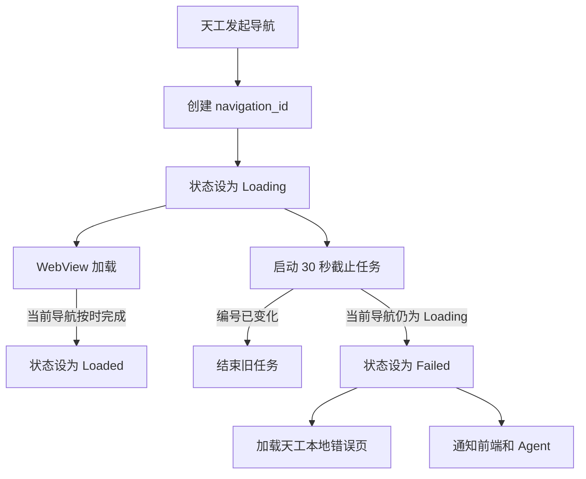

# 浏览器页面加载异常统一处理方案

> 状态：已确认，实施中
> 日期：2026-07-30
> 适用范围：Desktop 嵌入式浏览器

## 1. 背景

天工已通过自有 wry 补丁修复 macOS WKWebView 导航期间 `URL()` 暂时为空导致的进程退出。该补丁只保证进程稳定；域名不存在、连接失败、加载超时或底层取消后，WebView 仍可能停留在白屏。

本次不继续扩展 wry。天工对自己发起的导航设置固定截止时间，截止前没有收到页面加载完成通知时，统一判定为页面加载异常。

## 2. 决策

- wry 继续精确锁定现有空 URL 防崩溃提交 `4fb16fa0ca6b4b8fa65edc5d3875d9726429285b`。
- 不在 wry 增加 WKNavigation 失败回调、错误分类、错误页或公开接口。
- 天工不猜测失败原因，也不根据残留正文判断页面是否可用。
- 每次导航的业务截止时间固定为 30 秒。
- Agent 命令通道保护时间为 35 秒，给状态转换和结果回传保留 5 秒。
- 截止前没有收到当前导航的完成通知时，一律进入 `Failed`，错误类型统一为 `page_load_error`。

这种策略会把超过 30 秒才完成的正常慢页面判定为异常，这是明确的产品规则，不是运行时猜测。

## 3. 目标

- 页面未完成时不得无限白屏。
- 失败后在原生 WebView 内显示天工生成的本地错误页。
- 标签地址继续显示用户请求地址，并可重新加载。
- 新导航不能被旧导航的超时任务覆盖。
- 失败页不得进入全局历史，不得作为成功正文提供给 Agent。
- `web_fetch` 和 `observe_page` 必须返回明确失败状态。
- Windows、Linux、移动端和 wry 公共行为保持不变。

## 4. 非目标

- 不识别 DNS、拒绝连接、TLS、网络断开和底层取消的具体原因。
- 不提前响应 WebKit 已经知道的失败；所有未完成导航都等待统一截止时间。
- 不把网站正常返回的 HTTP 404 或 500 页面判为加载异常。
- 不根据页面是否已有部分正文延长等待或改判成功。
- 不新增 Tauri 或 wry fork。

## 5. 状态模型

每个 `session_id + tab_id` 独立维护当前导航：

```text
Loading {
  navigation_id,
  requested_url,
  started_url,
  document_id
}

Loaded {
  navigation_id,
  requested_url,
  final_url
}

Failed {
  navigation_id,
  requested_url,
  kind: "page_load_error",
  message: "页面未能在 30 秒内完成加载"
}
```

每次由地址栏、页面点击、Agent、后退、前进或刷新发起新的主动导航时递增 `navigation_id`。每个实际页面由初始化脚本生成独立的 `document_id`。加载开始、页面完成和超时任务更新状态前必须核对导航编号；页面完成还必须确认实际文档编号一致且 `document.readyState` 为 `complete`。

页面自身的重定向不创建新导航编号。新文档可以继续加入当前重定向链，前一个文档编号会被记录为已替代；地址是否曾经出现过不能作为拒绝新文档的依据。

## 6. 处理流程



### 6.1 导航开始

开始导航时按顺序执行：

1. 解析并保存用户请求地址。
2. 为目标标签生成新的 `navigation_id`。
3. 将状态设为 `Loading`，清除该标签的旧失败快照。
4. 发出 `browser:navigation_state` 的 `loading` 事件。
5. 调用 WebView 导航。
6. 启动绑定 `session_id + tab_id + navigation_id` 的 30 秒截止任务。

如果 URL 在调用 WebView 前已经无法解析，直接进入相同的 `Failed` 流程，不等待 30 秒。

### 6.2 页面按时完成

页面完成回调只处理仍为当前的导航：

1. 读取实际文档编号、完成状态、标题、最终地址和正文。
2. 核对导航编号、实际文档编号和最终地址，拒绝旧页面的迟到事件。
3. 将状态设为 `Loaded` 并唤醒等待方。
4. 更新标签地址和标题。
5. 写入标签历史和全局历史。
6. 发出 `browser:navigation_state: loaded`。
7. 发出兼容的 `browser:page_loaded`。

`browser:page_loaded` 必须携带真实 `session_id` 和 `tab_id`。

页面处于 `Loading` 时发生的重定向只更新当前导航的 `document_id` 和最终地址候选，不调用新的导航入口，因此不会重启 30 秒截止任务。整条重定向链必须在最初主动导航开始后的 30 秒内完成。

### 6.3 截止时间到达

截止任务到达后只做确定判断：

- 标签或会话已经关闭：结束任务。
- 当前 `navigation_id` 已改变：结束旧任务。
- 当前状态不再是 `Loading`：结束任务。
- 当前状态仍是 `Loading`：统一标记为 `Failed`。

不得读取正文后改判成功，不得继续延长等待。

### 6.4 本地错误页

天工生成不依赖网络的 HTML，并通过现有 WebView 加载：

- 标题：页面加载异常。
- 展示原请求地址。
- 说明页面未能在 30 秒内完成加载。
- 提供重新加载入口。
- 根元素带 `data-tiangong-navigation-error="true"`。
- 地址和文案必须进行 HTML 转义。
- 不加载远程脚本、图片、字体或样式。

加载错误页不得创建新的业务 `navigation_id`。错误页完成回调不得把状态改回 `Loaded`，不得写入历史或发出 `browser:page_loaded`。

## 7. 地址和历史规则

- `requested_url` 是地址栏、失败事件和重试的唯一来源。
- 错误页内部的 `data:` URL 不得覆盖标签地址。
- 每个标签独立维护可以重复记录相同地址的导航栈和当前位置。
- 普通导航截断当前位置之后的前进记录，再追加请求地址；从 `A → B` 再访问 A 时记录为 `A → B → A`。
- 后退、前进只移动当前位置；刷新和失败重试保持当前位置，这四类操作均不追加记录。
- 页面重定向只更新当前导航的文档标识；成功后更新当前记录的最终地址和标题，不记录中间地址、不新增历史、不改变 Agent 标签归属。
- 失败请求地址保留在当前标签记录中，便于后退、前进和重试。
- 全局历史只记录成功完成的真实页面，可以按地址合并并更新最后访问时间，不参与标签导航。
- 错误页、空地址、`about:blank` 和内部 `data:` URL不进入全局历史。
- 重试成功后正常更新标题和历史。

## 8. Agent 行为

### 8.1 web_fetch

`web_fetch` 使用同一个 30 秒业务截止时间：

- 根据请求地址的主域名选择带内部来源标记的 Agent 工作标签。
- 同一主域名复用已有工作标签，不同主域名首次访问时创建新工作标签。
- 不复用、覆盖或关闭用户标签；重定向和失败重试继续使用原工作标签。
- `Loaded`：提取并返回正常页面内容。
- `Failed`：立即返回 `ok = false`，错误为“页面未能在 30 秒内完成加载”。
- 命令通道最多等待 35 秒，不能先于业务失败结果结束。

错误页正文不得进入 `stdout`。

### 8.2 observe_page

当前标签为 `Failed` 时返回：

```text
status = PageStatus::Error("页面未能在 30 秒内完成加载")
url = requested_url
text = ""
```

浏览器自动观察器收到 `PageStatus::Error` 后不得注入 `browser_data`。

## 9. 前端行为

前端监听 `browser:navigation_state`，并按 `session_id + tab_id` 过滤：

- `loading`：保留请求地址。
- `loaded`：刷新标签元数据和历史。
- `failed`：保留请求地址，错误内容由原生 WebView 内的本地页显示。

失败状态下点击工具栏刷新必须重新调用 `browser_navigate(requested_url)`，不能对内部错误文档执行 `location.reload()`。

## 10. 并发和生命周期

### 10.1 快速连续导航

导航 A 后立即导航 B 时，B 获得新的 `navigation_id`。加载开始、加载完成和截止任务更新状态前均需核对编号；底层事件无法直接携带编号时，通过初始化脚本为每个实际文档生成 `document_id`，明确属于旧导航的文档会被拒绝，新文档可以进入当前导航链。不能仅因新文档地址曾被访问过就拒绝它。A 的迟到事件和截止任务不能覆盖 B。

### 10.2 多标签和多会话

- 截止任务绑定真实标签，不使用当前活动标签推断。
- 后台标签失败只更新自身。
- 会话切换不改变旧会话任务的目标。
- 标签或会话关闭后，等待方被唤醒，截止任务自然结束。

### 10.3 错误页加载

错误页使用内部标记，完成回调发现该标记后保持 `Failed`。如果错误页本身无法加载，仍保留失败状态并记录一次简短日志，不再递归加载。

## 11. 代码范围

### 后端

- `manager.rs`：导航状态、编号、截止任务、错误页、完成回调和历史过滤。
- `bridge.rs`：通过 `include_str!` 在编译期静态引入页面状态和页面快照脚本，运行时不读取源码文件。
- `js/document-state.js`：读取加载开始时的实际文档编号、状态和地址。
- `js/page-snapshot.js`：读取页面完成时的实际文档编号、状态、地址、标题和正文。
- `types.rs`：导航状态事件。
- `handler.rs`：`web_fetch`、`observe_page` 的失败返回。
- `page_fetcher.rs`：Agent 命令保护时间调整为 35 秒。
- `watcher.rs`：忽略失败快照。

### 前端

- `BrowserTabContent.tsx`：监听失败状态并修正刷新行为。
- `BrowserPanel.tsx`：同步修正旧面板的刷新行为。

### 依赖

- `Cargo.toml` 和 `Cargo.lock` 中的 wry 提交保持不变。

## 12. 验证方案

### 后端检查

```bash
cargo fmt --all -- --check
cargo test -p tiangong-plugin-browser --lib --locked
cargo check -p tiangong-app --locked
```

### 前端检查

```bash
yarn --cwd frontend build
```

### macOS 实际场景

- 不存在域名：30 秒后显示错误页，Agent 返回失败。
- 本机未监听端口：30 秒后显示错误页。
- 本地服务接受连接但不返回：30 秒后显示错误页。
- 底层取消且没有新导航：30 秒后显示错误页。
- A 后立即导航 B：A 的截止任务不覆盖 B。
- 先访问 A，再请求 B 且 B 重定向到 A：新文档正常完成，不因地址 A 曾经出现而超时。
- 多次重定向：整条链共享最初主动导航的 30 秒截止时间。
- 错误页刷新：重新请求原地址；服务恢复后正常打开。
- 多标签和多会话：失败状态互不串台。

## 13. 验收标准

- 已知失败、超时和终态取消场景最多白屏 30 秒，随后显示明确错误页。
- 正常页面在 30 秒内完成时行为不变。
- 旧截止任务不能覆盖新页面。
- 地址栏、标签历史、全局历史和 Agent 结果一致。
- 错误页正文不会提供给 Agent。
- wry 依赖提交保持 `4fb16fa0ca6b4b8fa65edc5d3875d9726429285b`。
- Rust 检查、前端构建和 macOS 实际场景全部通过。

## 14. 回退

本次只修改天工。若固定截止策略误伤正常慢页面，可回退天工修复分支；wry 依赖无需变化。截止时间是否调整属于产品策略变更，需单独确认后再修改。
