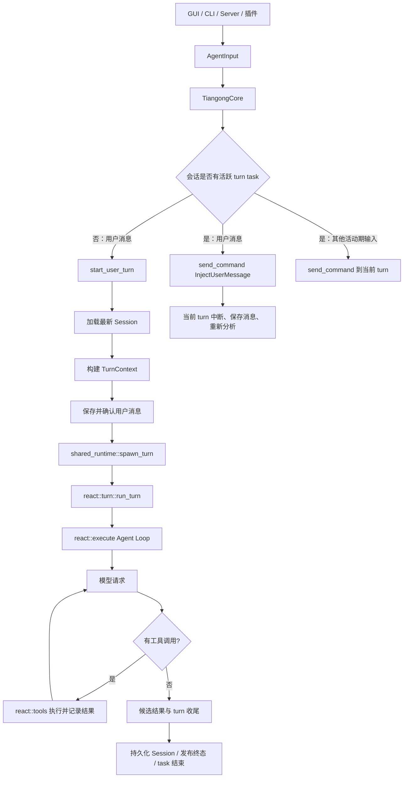

# Core 架构

> 本文描述当前 `crates/tiangong-core`。旧 `src/core` planning/execution 分层、常驻
> Driver、Agent Inbox 和统一常驻命令通道均不是现行架构。

## 1. 总览



当前执行模型不是常驻 Agent 进程：

- 一个会话同时至多登记一个活跃 turn task；
- task 只覆盖当前 turn 或手动压缩任务；
- task 持有自己的 `TurnContext` 和命令接收端；
- task 结束后注册表条目与命令通道失效；
- 下一条空闲用户消息从最新 Session 创建新 task。

## 2. 核心模块

### `core/mod.rs`

`TiangongCore` 是对外协调入口：

- 接收 `AgentInputKind`；
- 加载 Session 和配置；
- 构建每轮 `TurnContext`；
- 空闲时通过 `start_user_turn` 创建 turn；
- 运行中通过 `shared_runtime::send_command` 投递输入；
- 处理标题、配置、压缩、清空和关闭等会话操作。

### `shared_runtime.rs`

提供：

- 进程级 multi-thread Tokio runtime；
- `session_id → TurnTask` 活跃任务注册表；
- `spawn_turn`、`send_command`、`is_running`、`cancel_and_join`；
- task 代际检查，防止旧任务结束时误删新任务。

它不是常驻 Driver，也不保存 Agent Inbox。

### `turn_context.rs`

`TurnContext` 是单个 turn 的执行材料：

- 当前 Session；
- 模型客户端；
- 插件与工具；
- 信任模式和 Agent 配置；
- StreamEvent 发送端；
- 上下文和观测能力。

后续 turn 会重新构建上下文，不复用未来 Session 快照。

### `react/turn.rs`

负责单轮外围生命周期：

- 插件 turn 开始/结束通知；
- 调用 Agent Loop；
- 提交成功、失败或取消状态；
- 最终持久化和终态事件。

### `react/execute.rs`

负责当前 turn 内的 Agent Loop：

1. 构建并发送模型请求；
2. 处理流式输出与用量；
3. 记录 assistant 文本或工具调用；
4. 执行工具批次并写入结果；
5. 根据结果继续请求模型或结束本轮；
6. 在活动阶段接收并处理当前 turn 的命令。

### `react/command.rs`

集中处理当前 turn 的命令效果。

用户引导消息的关键路径是：

```text
Command::InjectUserMessage
  → interrupt_active_work
  → save_user_message_and_restart
  → ExecutionPhase::NeedModel
```

这里的“restart”是当前 turn 内从新意图重新分析，不是恢复某个常驻 Driver。

### `react/tools.rs`

负责：

- 工具调用校验和去重；
- 权限与当前审批等待；
- 工具并行执行和顺序提交；
- 工具结果消息与 Provider 协议闭合；
- 工具执行期间命令处理。

审批/交互插件化仍在演进，当前实现不应被推导为最终架构。

### `session.rs`

定义会话消息与持久化格式。Session 是跨 turn 的权威状态；运行时 task、命令通道和插件 UI 订阅不属于 Session 持久化内容。

## 3. 用户消息路由

### 空闲用户消息

```text
AgentInputKind::Message
  → TiangongCore::start_user_turn
  → load_session / build_turn_context
  → 保存消息并发布 UserMessage
  → shared_runtime::spawn_turn
  → run_turn
```

### 运行中用户消息

```text
AgentInputKind::Message
  → shared_runtime::send_command(Command::InjectUserMessage)
  → 当前 turn 中断活动工作
  → 保存新消息
  → 从新意图继续模型分析
```

### 收尾期间到达的消息

如果本轮收尾时命令通道仍有未处理的用户消息，task wrapper 会排空并保存；最后一条可接续创建新 turn，避免已经确认的输入静默丢失。

## 4. 其他输入

- **工具注入**：活动时进入当前 turn；空闲时写入 Session 延迟队列。
- **审批/交互响应**：当前版本仍通过活动 turn 命令处理；后续插件化设计应以真实用户消息路由为基础。
- **手动压缩**：空闲时创建独立 task；用户消息可中断压缩并开始新 turn。
- **取消/关闭**：向当前 task 发送命令，并在关闭路径等待 task 结束。
- **插件反馈**：发送端绑定当前 turn，通道关闭后迟到反馈失败。

## 5. 审查准则

讨论或审查 Agent Core 时：

1. 不得假设存在 Agent Inbox 或常驻 Driver。
2. 必须区分空闲起轮与活动 turn 命令处理。
3. 必须以 `TiangongCore::deliver`、`start_user_turn`、`shared_runtime` 和 `react` 当前代码为准。
4. “复用引导消息逻辑”应具体说明复用 `AgentInputKind::Message`、`Command::InjectUserMessage` 和空闲 `start_user_turn` 的哪一部分。
5. 历史迁移方案不作为现行行为合同。

专题说明见：`docs/agent-loop-refactor/design.md`。
