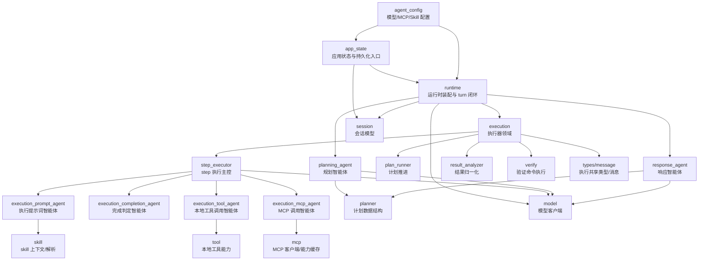
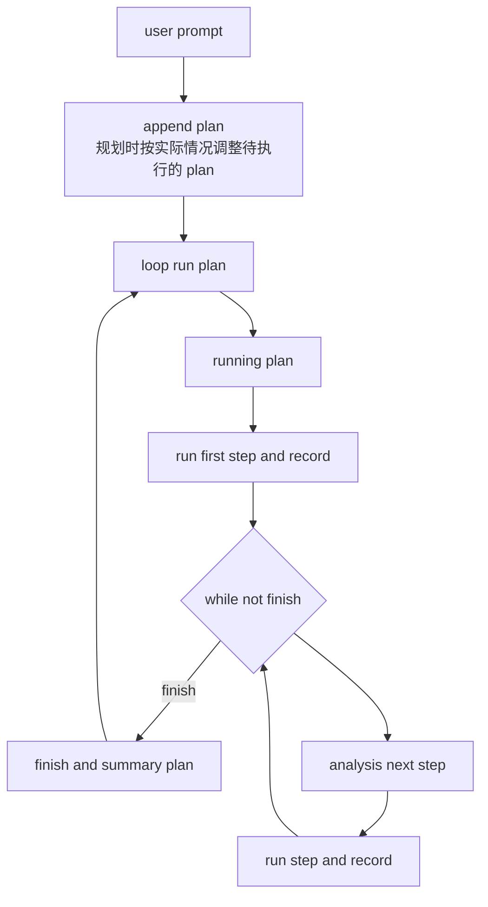
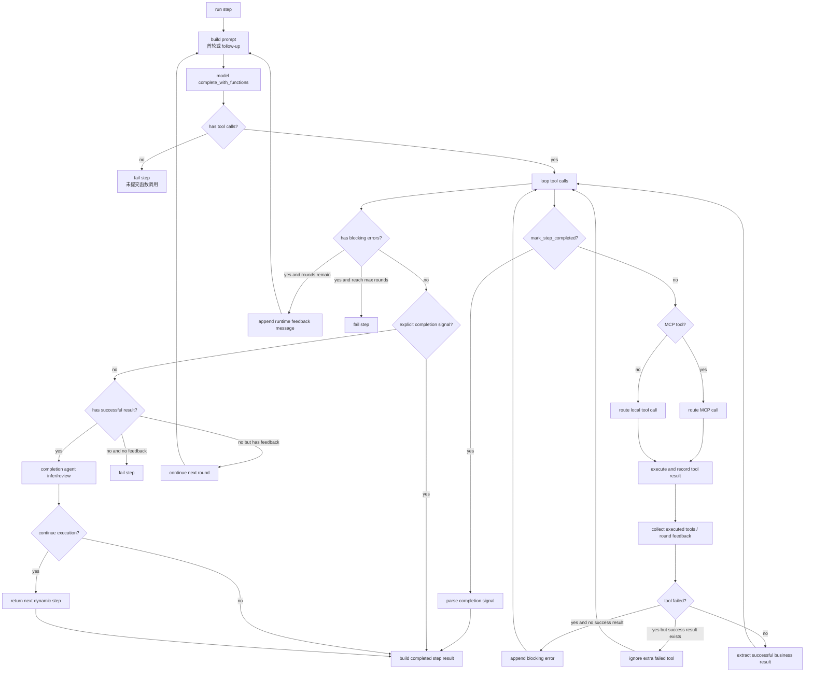
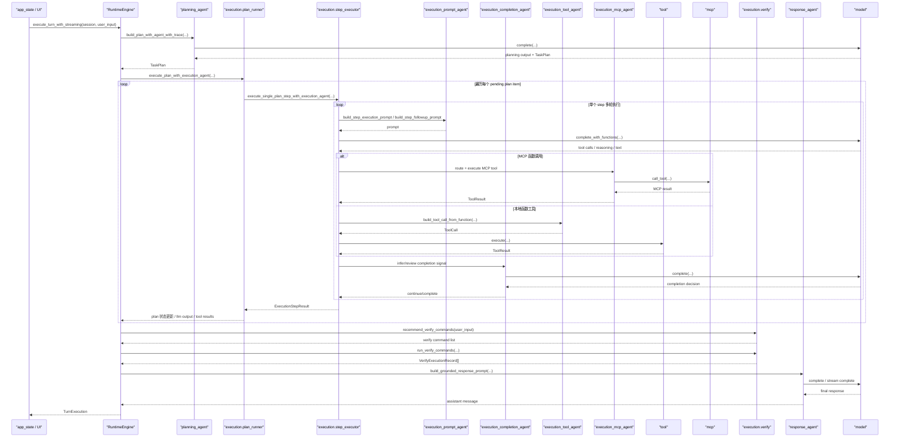

# Core 架构图

## 1. 当前分层

当前 `src/core` 可以分为 5 个层次：

1. 配置与状态层
2. 智能体层
3. 执行器层
4. 能力层
5. 运行时装配层



## 2. 核心目录职责

### 2.1 运行时装配层

- `src/core/runtime.rs`
  - `RuntimeEngine` 对外统一入口
  - 装配 `planning -> execution -> response`
  - 对外暴露 `RunSnapshot`、`TurnExecution`、`LlmOutputRecord`

### 2.2 执行器层

- `src/core/execution/mod.rs`
  - `execution` 领域导出入口

- `src/core/execution/plan_runner.rs`
  - 推进 plan item 和 execution step
  - 管理动态 step 插入
  - 聚合 step report 和 plan execution summary

- `src/core/execution/step_executor.rs`
  - 单个 step 的多轮执行主控
  - 驱动 execution 相关子 agent
  - 路由本地工具与 MCP 工具
  - 收敛完成信号并产出 `ExecutionStepResult`

- `src/core/execution/result_analyzer.rs`
  - 提取成功业务结果
  - 聚合 LLM 输出
  - 规范工具反馈与失败摘要

- `src/core/execution/verify.rs`
  - 推荐验证命令
  - 执行验证命令
  - 返回 `VerifyExecutionRecord`

- `src/core/execution/types.rs`
  - 执行器领域共享类型：
    - `ExecutionLlmOutput`
    - `ExecutionStepReport`
    - `ExecutionStepResult`
    - `DynamicPlanStep`
    - `LlmOutputRecord`

- `src/core/execution/message.rs`
  - `runtime_message`
  - 负责 execution 领域内部运行时消息构造

### 2.3 智能体层

- `src/core/agents/planning_agent.rs`
  - 规划智能体

- `src/core/agents/response_agent.rs`
  - 响应生成智能体

- `src/core/agents/skill_convert_agent.rs`
  - 外部 skill 转换智能体

- `src/core/agents/execution_prompt_agent.rs`
  - 执行阶段 prompt 构造
  - 包括首轮 prompt 和 follow-up prompt

- `src/core/agents/execution_completion_agent.rs`
  - 步骤完成判定
  - 自动继续执行的复核判定

- `src/core/agents/execution_tool_agent.rs`
  - 本地函数工具定义
  - 函数调用到本地 `ToolCall` 的转换

- `src/core/agents/execution_mcp_agent.rs`
  - MCP 函数工具暴露
  - MCP tool 路由与调用

### 2.4 能力层

- `src/core/tool.rs` + `src/core/tool/*`
  - 本地工具能力
  - 包括文件读取、目录遍历、命令执行、补丁应用、代码搜索等

- `src/core/mcp/*`
  - MCP client、配置、上下文、能力缓存

- `src/core/skill/*`
  - Skill 分析、上下文、初始化、打包相关逻辑

### 2.5 模型与状态层

- `src/core/model.rs`
  - 模型客户端抽象

- `src/core/planner.rs`
  - 计划结构与状态模型

- `src/core/session.rs`
  - 会话数据结构

- `src/core/agent_config.rs`
  - 模型/MCP/Skill 配置结构

- `src/core/app_state/*`
  - 应用状态 façade
  - 状态切片、持久化、service、repository
  - 面向 UI/TUI 的状态协调层

## 3. 当前调用主链路

```text
app_state
  -> runtime.execute_turn_with_streaming
    -> planning_agent
    -> execution.plan_runner
      -> execution.step_executor
        -> execution_*_agent
        -> tool / mcp
    -> execution.verify
    -> response_agent
```

## 4. 执行时序图

下面的时序图对应一次典型的用户输入执行流程。

### 4.1 简化流程图



### 4.2 Run Step 展开图





## 5. 当前架构特点

### 5.1 优点

- `agents` 与 `execution` 已经形成初步分层
- `runtime` 不再直接承载大量执行细节
- execution 相关结果模型已经统一收敛
- 为后续“智能体配置化”留出了边界

### 5.2 当前仍可继续优化

- `runtime.rs` 仍然是单文件 façade，后续可目录化
- `agents` 还没有统一的 agent descriptor / trait
- 部分 `execution_*_agent` 实际上更像策略模块，而不完全是 LLM agent
- `app_state` 仍然依赖 `runtime` 作为总装配入口，未来可继续解耦成更明确的 factory / orchestrator

## 6. 下一步建议

1. 将 `runtime.rs` 目录化，拆成 turn 执行、响应收尾、流式输出装配几个子模块
2. 给 `agents` 定义统一描述结构：
   - `agent_id`
   - `agent_role`
   - `prompt_source`
   - `enabled`
   - `tool_scope`
3. 基于配置文件实现 execution 子 agent 的可装配化
