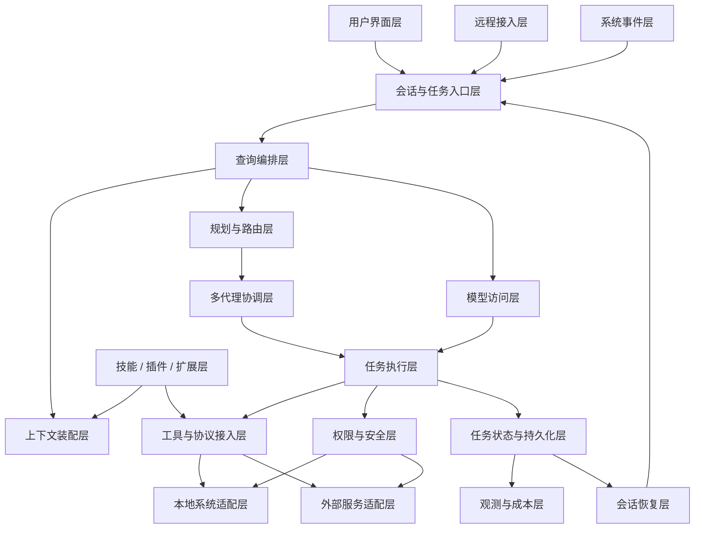
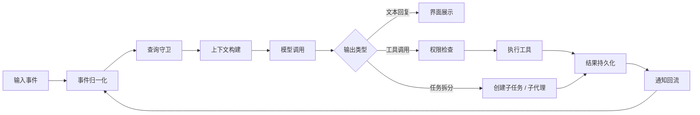
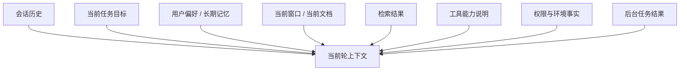
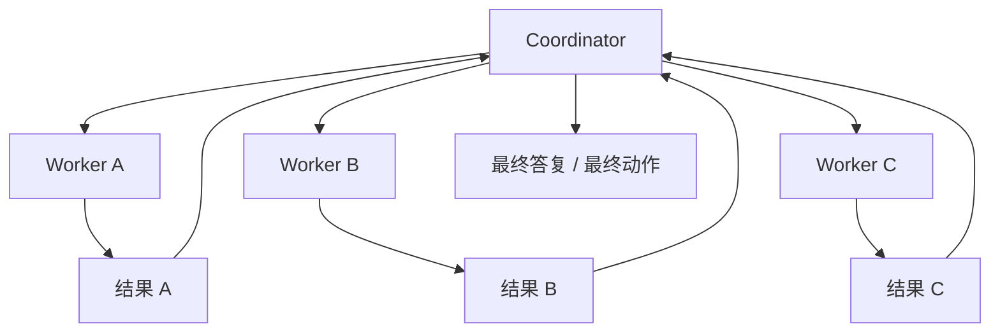
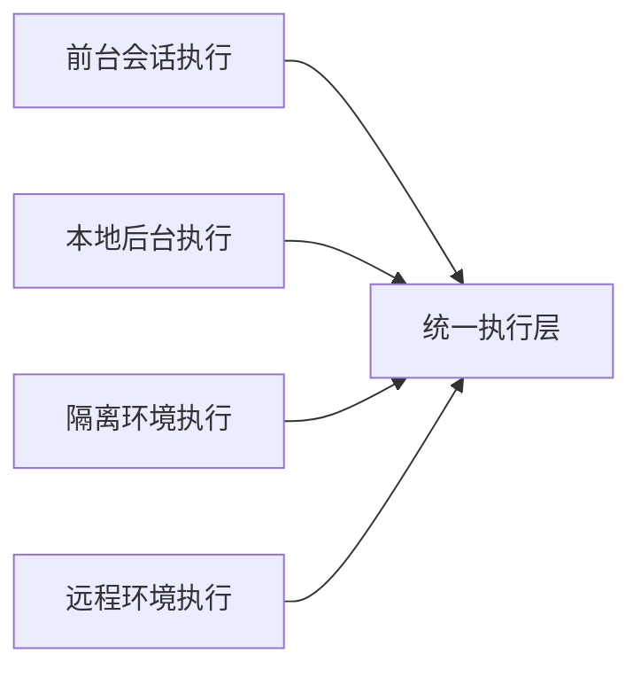
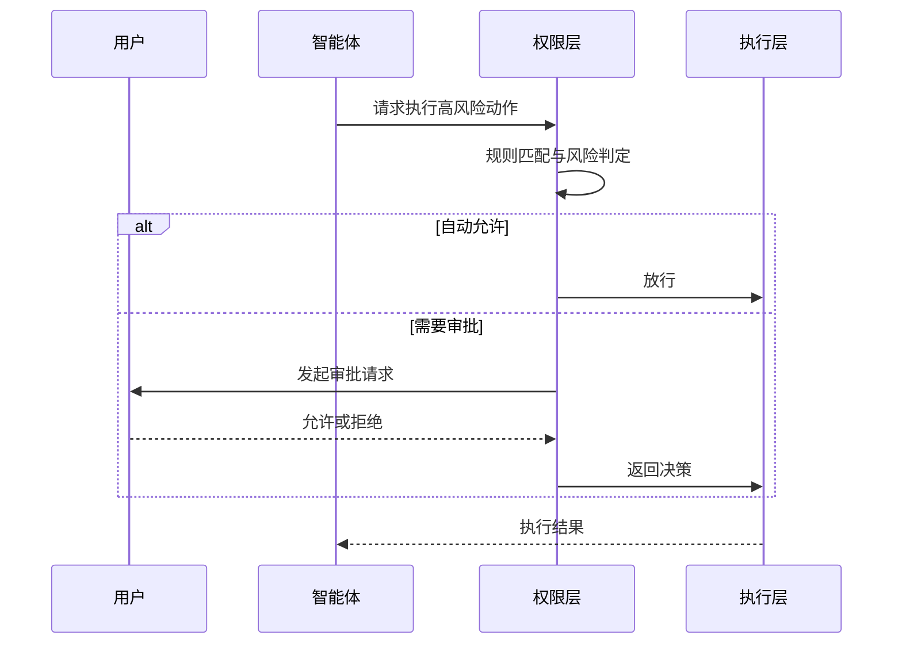
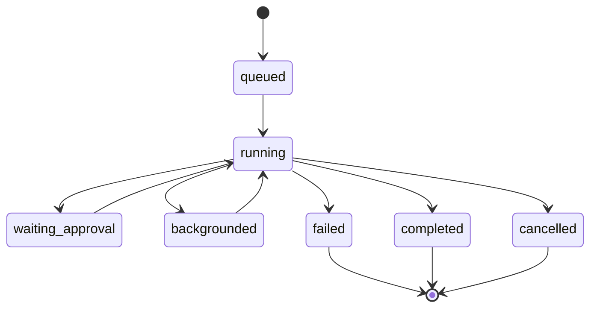
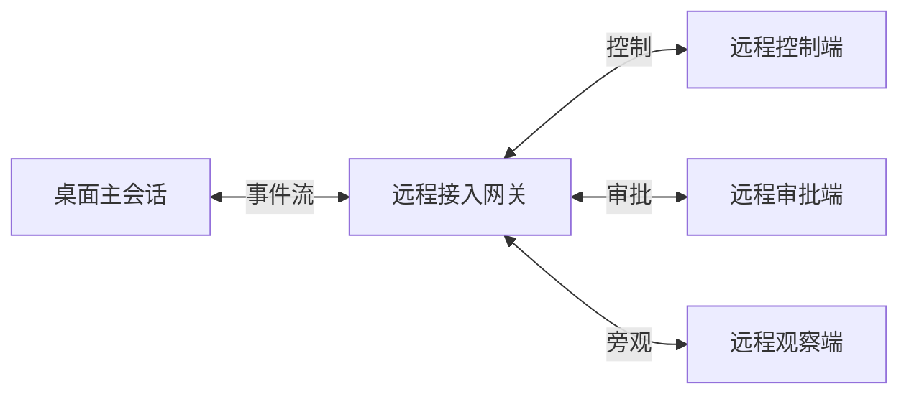
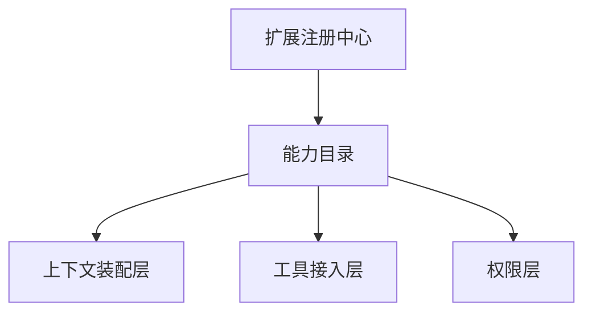
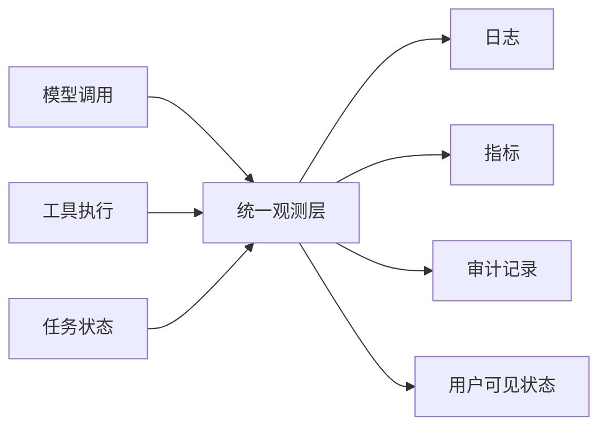

# 桌面端智能体纯技术架构

## 1. 目标

本文档给出一套面向桌面端智能体产品的纯技术架构，不依赖任何具体项目实现。

设计目标如下：

- 支持多轮会话与长期任务
- 支持本地工具、系统能力和外部服务接入
- 支持后台运行、任务通知和中断恢复
- 支持多代理协作与任务拆分
- 支持权限审批、审计和安全隔离
- 支持可扩展的插件、技能和外部协议接入

## 2. 产品级总体架构

这套架构可以理解为五个核心闭环：

- 输入闭环：用户、远程端、系统事件统一进入会话入口
- 推理闭环：查询编排、上下文装配、模型访问循环运行
- 执行闭环：工具、权限、执行结果、通知回流形成操作链
- 任务闭环：前台任务、后台任务、恢复、持久化统一建模
- 扩展闭环：技能、插件、协议接入按需装配进入运行时

## 3. 分层架构

### 3.1 界面与入口层

负责统一接收不同来源的输入：

- 用户文本输入
- 文件拖拽与附件
- 语音与截图输入
- 后台任务通知
- 远程控制或旁观输入
- 操作系统事件

这一层只负责接入与展示，不负责执行核心推理逻辑。

### 3.2 会话与任务入口层

负责把不同来源的输入标准化成运行时事件：

- 用户消息
- 工具结果
- 权限请求
- 任务状态变更
- 外部系统回调
- 后台任务完成通知

这一层需要一个统一事件模型，而不是让不同类型事件走不同逻辑分支。

### 3.3 查询编排层

查询编排层是整个智能体的控制中心，负责：

- 接受当前事件
- 判断是否打断正在运行的任务
- 裁剪或恢复会话状态
- 决定是否需要规划、多代理或直接回答
- 决定是否发起模型调用
- 决定是否进入工具执行回合

### 3.4 上下文装配层

负责把可用信息整理成当前轮可消费的上下文视图，包括：

- 历史消息
- 当前任务目标
- 用户偏好与长期记忆
- 当前活跃文档或窗口信息
- 检索命中内容
- 工具可用性说明
- 权限与环境事实

### 3.5 规划与路由层

负责判断当前问题属于哪一类执行模式：

- 直接回答
- 单工具执行
- 多步工具链执行
- 子任务拆分
- 多代理并行执行
- 长任务后台运行

### 3.6 模型访问层

负责与模型提供方交互，并提供统一抽象：

- 模型选择
- 推理强度选择
- 工具调用协议
- 流式输出
- 重试与超时
- 成本与用量统计

### 3.7 多代理协调层

负责在复杂任务下管理多个工作单元：

- coordinator 负责拆分和汇总
- worker 负责具体执行
- 每个 worker 拥有独立上下文边界
- worker 可运行在前台、后台或隔离环境

### 3.8 工具与协议接入层

负责把智能体能力抽象成统一调用接口：

- 本地命令执行
- 文件系统读写
- 应用控制
- 浏览器自动化
- 企业系统 API
- 知识库和搜索接口
- 外部插件协议

### 3.9 权限与安全层

负责所有高风险能力的前置控制：

- 读写权限
- 命令执行权限
- 网络访问权限
- 敏感目录限制
- 外部系统作用域限制
- 审计日志

### 3.10 状态、恢复与观测层

负责长期运行所需的基础能力：

- 会话状态存储
- 任务状态存储
- 输出持久化
- 崩溃恢复
- 成本统计
- 指标采集
- 用户可见审计

## 4. 运行时核心数据流

这个数据流说明，智能体不是“一问一答”，而是一个事件驱动状态机。

## 5. 核心运行时模型

### 5.1 事件模型

所有输入和状态变化都应转成统一事件对象。建议最少包含：

- `event_id`
- `event_type`
- `session_id`
- `task_id`
- `source`
- `payload`
- `created_at`

典型事件类型：

- `user_message`
- `tool_result`
- `permission_request`
- `permission_response`
- `task_started`
- `task_completed`
- `task_failed`
- `notification`
- `system_signal`

### 5.2 会话模型

会话不只是聊天记录，还应包含：

- 当前模式
- 活跃任务
- 当前上下文快照
- 最近工具调用记录
- 权限待处理项
- 预算与成本统计
- 恢复点

### 5.3 任务模型

任务模型建议覆盖以下状态：

- `queued`
- `running`
- `blocked`
- `waiting_approval`
- `backgrounded`
- `completed`
- `failed`
- `cancelled`

同时应记录：

- 输入摘要
- 负责执行的代理
- 当前进度
- 结果位置
- 关联会话
- 关联工作目录或环境

## 6. 上下文架构

### 6.1 上下文来源分层

设计原则：

- 不是所有来源都永久注入
- 每一轮都应重新选择
- 能用引用表示时，不传全文
- 能用摘要表示时，不传原文
- 能延迟加载时，不提前加载

### 6.2 上下文装配策略

建议采用以下装配顺序：

1. 确定当前任务目标
2. 提取必要历史
3. 加入环境与权限事实
4. 注入用户长期偏好
5. 补充当前工作对象
6. 按需注入检索结果
7. 按需注入工具说明
8. 进行预算控制和压缩

### 6.3 上下文压缩策略

桌面端智能体应默认具备：

- 历史折叠
- 结果摘要
- 大文件分段读取
- 重复内容去重
- 工具结果裁剪
- 超预算自动压缩

## 7. 规划与多代理架构

### 7.1 单代理与多代理切换条件

以下场景优先考虑多代理：

- 任务可以并行拆分
- 子任务上下文差异明显
- 需要长时间外部 IO
- 需要隔离不同执行环境
- 需要把高风险操作限制在独立边界

### 7.2 多代理协作图

### 7.3 Worker 边界

每个 worker 应有自己的：

- 任务目标
- 可用工具集
- 可见上下文范围
- 工作目录或沙箱
- 预算上限
- 结果输出位置

这样才能避免多代理互相污染状态。

## 8. 工具与执行架构

### 8.1 工具抽象

建议把所有能力统一抽象为可声明的工具：

- 工具标识
- 输入 schema
- 输出 schema
- 权限要求
- 执行环境
- 是否允许后台
- 是否允许流式输出

### 8.2 执行环境分级

常见执行环境：

- 前台同步执行
- 本地后台执行
- 独立工作区执行
- 容器或沙箱执行
- 远程主机执行

### 8.3 工具执行闭环

1. 查询编排层选择工具
2. 权限层判断是否可执行
3. 执行层运行工具
4. 输出进入持久化层
5. 结果转换成标准事件
6. 通知回流到会话

## 9. 权限与安全架构

### 9.1 权限审批时序

### 9.2 安全控制点

至少应覆盖以下控制点：

- 命令级规则
- 路径级规则
- 网络目标限制
- 数据出境限制
- 外部系统作用域
- 结果审计
- 身份与会话绑定

### 9.3 审计模型

每个高风险动作至少记录：

- 发起会话
- 发起任务
- 发起代理
- 权限决策
- 执行参数摘要
- 执行结果摘要
- 时间戳

## 10. 后台任务架构

### 10.1 后台任务设计原则

- 前台和后台使用同一任务模型
- 后台任务完成后必须能回流到会话
- 后台任务输出不能只存在内存中
- 后台任务必须可取消、可恢复、可追踪

### 10.2 后台任务状态图

### 10.3 通知回流

后台任务结束后，不应只在系统托盘展示结果，还应生成标准化通知事件重新进入会话系统，以便：

- 让模型消费结果
- 让用户继续追问
- 让后续任务依赖该结果

## 11. 远程接入架构

### 11.1 远程角色

远程接入至少可以区分三类角色：

- 控制者
- 审批者
- 观察者

### 11.2 远程会话拓扑

### 11.3 远程设计原则

- 远程不是单独产品，而是会话协议的延伸
- 所有远程动作也应走同一权限模型
- 远程端应能看到任务状态和审批状态
- 远程端不应绕过本地安全边界

## 12. 扩展架构

### 12.1 扩展层组成

桌面端智能体的扩展层通常包含：

- 技能
- 插件
- 工具包
- 外部协议适配器
- 企业系统连接器

### 12.2 扩展装配原则

- 元数据先加载，正文后加载
- 能力按需暴露
- 失败不阻塞主运行时
- 安装、升级、失效状态独立管理

### 12.3 扩展运行时关系图

## 13. 恢复与持久化架构

### 13.1 需要持久化的内容

- 会话消息摘要
- 当前任务状态
- 后台任务输出
- 工具执行记录
- 权限待处理项
- 用户偏好和长期记忆
- 成本与用量

### 13.2 恢复目标

恢复不是为了“重新显示聊天记录”，而是为了恢复智能体现场：

- 当前会话还在做什么
- 哪些任务仍在运行
- 上下文哪些部分可继续复用
- 哪些审批还未处理
- 上次中断发生在哪一步

## 14. 观测与成本架构

### 14.1 关键指标

- 会话延迟
- 模型延迟
- 工具执行延迟
- 审批等待时长
- 后台任务完成率
- 错误率
- 单任务成本
- 单会话成本

### 14.2 可观测性设计

### 14.3 成本治理

成本治理建议按三个层次做：

- 请求级：单次调用成本
- 任务级：单任务累计成本
- 会话级：整轮工作累计成本

## 15. 推荐的最小可行架构

如果要从零开始实现桌面端智能体，最小可行版本建议至少包含：

1. 统一事件模型
2. 查询编排层
3. 上下文装配层
4. 工具抽象与权限层
5. 任务状态机
6. 后台任务回流
7. 恢复与审计

没有这些基础设施，产品通常只能停留在“带几个工具的聊天框”阶段。

## 16. 结论

桌面端智能体的核心不是更大的模型窗口，而是完整的运行时系统。

一套成熟的产品架构，必须把以下能力作为底层而不是附加功能：

- 事件驱动会话
- 上下文编排
- 工具与执行统一抽象
- 权限与安全协议
- 后台任务与通知回流
- 多代理协调
- 扩展系统
- 恢复、观测与成本治理

只有这些能力成立后，桌面端智能体才具备持续执行复杂任务的基础。
