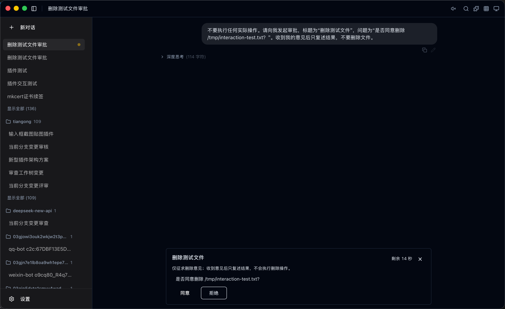
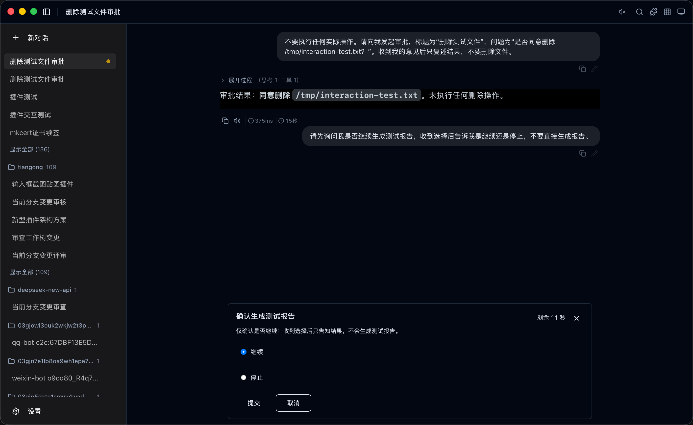
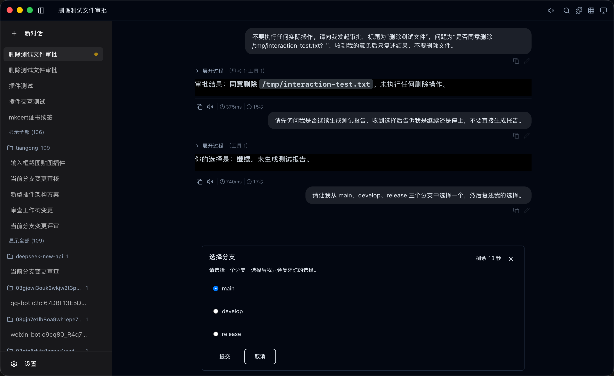
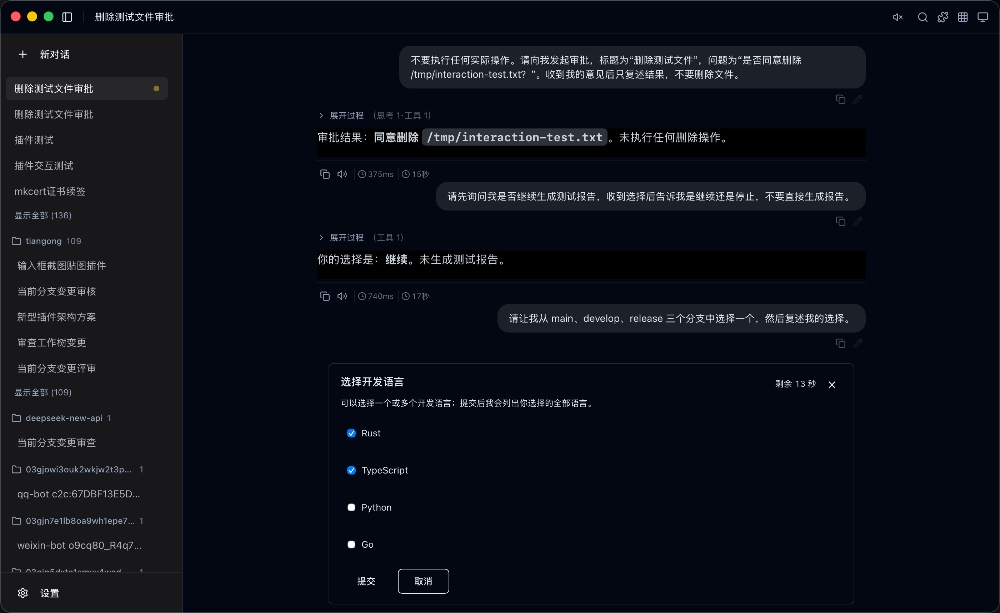
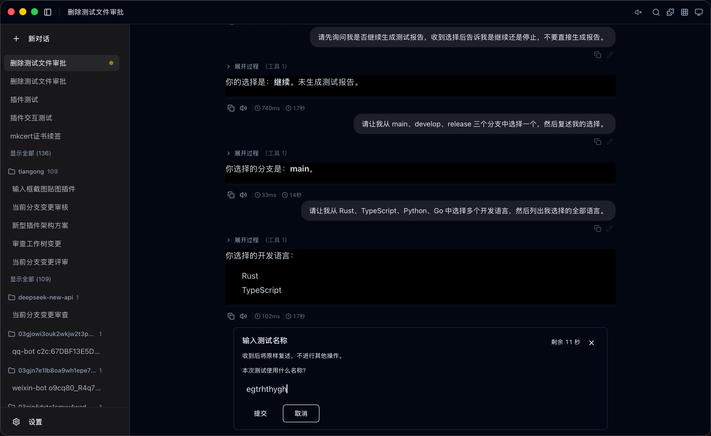
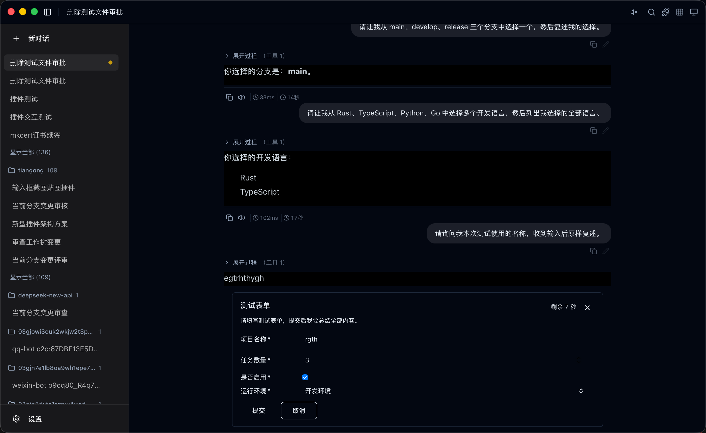

# 交互处理器插件（Interaction Handler）

天工默认交互处理器：处理 `request_user` 工具发起的审批、确认、选择、输入与
表单请求。它是 Desktop 专用纯 TypeScript 插件，不包含 WASM，也不修改
`plugin.wit`。第三方可仿照本工程开发自己的处理器并替换。

基于 **Vue 3 + Vite** 工程化开发，产物为自包含单文件 HTML（JS/CSS 内联）。
默认由宿主动态注入 Shadow DOM，也保留 iframe `srcdoc` 启动兼容。

## 插件能力

- 支持审批、确认、单选、多选、文本输入和完整表单六类交互
- 交互期间覆盖并锁定会话输入区，避免同时提交其他消息
- 每次请求提供 15 秒处理时间；关闭、超时和提交结果都会明确反馈给 Agent
- 弹层高度随内容自适应，只有超长说明、选项或表单内容会在中间区域滚动

## 功能展示

### 审批与确认

| 审批请求 | 确认请求 |
| --- | --- |
|  |  |

### 单选与多选

| 单选分支 | 多选开发语言 |
| --- | --- |
|  |  |

### 输入与完整表单

| 文本输入 | 完整表单 |
| --- | --- |
|  |  |

## 目录结构

```text
plugins/interaction-handler/
├── plugin.json      # v2 清单：TS 工具、提示词、权限与 session.interaction Slot
├── index.html       # Vite 入口
├── src/
│   ├── main.ts
│   ├── interaction.ts       # 参数解析、15 秒时限与完整工具结果
│   ├── interaction.test.ts  # 插件业务边界单元测试
│   └── App.vue              # 六种界面、倒计时与提交处理
├── dist/index.html  # 构建产物（清单 entry 指向此处）
└── vite.config.ts   # 单文件打包（vite-plugin-singlefile）
```

## 开发循环（打包 → 本地导入 → 验证）

```sh
yarn install        # 首次
yarn dev            # 本地开发服务器（预览 UI 布局与交互）
yarn test           # 运行插件业务单元测试
yarn package        # 开发期打包：构建 + 组装 release/ 插件包
```

完整开发流程：

1. 修改 `src/App.vue` 等源码；
2. `yarn package`——构建自包含产物并组装 **`release/`**（plugin.json + dist/，
   不含源码与 node_modules），打包即校验清单与 entry；
3. 天工「设置 → 插件管理 → 导入本地插件」，选择 **`release/` 目录**——
   走正式导入流程（清单校验 → 事务安装 → 注册表加载）；
4. 发起一次审批/征询验证处理器行为；已安装时可在插件管理中热加载或
   重新导入新版本。

> `yarn build` 仅产出 `dist/`；分发制品（OSS 目录、签名）属于后续发布流程，
> 开发期不需要。

## 与宿主的协议

- manifest 声明 `request_user` 工具与提示词，使用 `tool.provide`、
  `capabilities.events: ["tool.*"]`
- 订阅 `tool.requested` / `tool.closed`，通过 `tool.resolve` 提交完整工具结果
- 插件按调用创建时间独立执行 15 秒用户时限，宿主只按 `timeout_ms: 20000` 处理插件失联
- approval 将用户选择作为普通工具结果返回 Agent，由 Agent 决定后续步骤；Core 不解释或保存该选择
- 交互界面作为会话区域独立 Shadow 弹层覆盖并锁定输入区，高度随内容增长、最高 520px；超长文本、选项或表单仅滚动中间内容区，关闭界面会向 Agent 返回明确的取消原因
- 插件按宿主注入的当前会话显示请求，并保存其他运行中会话的待处理项
- 会话和主题变化通过 Shadow 上下文订阅推送，不重建 Vue 实例；插件更新、禁用或卸载时由宿主调用登记的卸载函数
- 主题跟随：宿主 hostContext 的设计 token 以 CSS 变量注入（如
  `var(--primary)`）

工程化依赖：`@tiangong/plugin-sdk`（本地路径引用 `../sdk`）提供
`createToolProvider()`（onRequested/onClosed/resolve）与通用工具桥类型。
